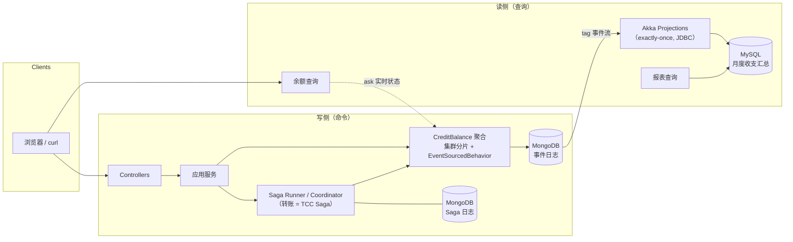

# Play Akka CQRS

[English](README.md) | **中文**

[](https://www.scala-lang.org/)
[](https://akka.io/)
[](https://www.playframework.com/)
[](https://jdk.java.net/11/)
[](#%E6%B5%8B%E8%AF%95)

一个"小而全"的 **DDD + CQRS + 事件溯源** 参考项目，基于 **Akka Typed 集群分片**构建。业务域为银行账户（开户、存款、取款、转账），跨聚合的转账由自研的 **TCC（Try-Confirm/Cancel）Saga 引擎**以类型安全的声明式 DSL 端到端驱动。

> **一句话**：通过 CQRS 写模型（MongoDB 事件日志）存取款；通过 Akka Projections 在 MySQL 物化读模型（月度收支汇总）；跨账户转账作为完全事件溯源、崩溃可恢复的 TCC Saga 运行。内置 Showcase 可以向运行中的 Saga 注入故障，观察它重试、补偿、挂起与恢复的全过程。

---

## 目录

- [特性总览](#特性总览)
- [架构总览](#架构总览)
- [模块划分](#模块划分)
- [快速上手](#快速上手)
- [HTTP API 参考](#http-api-参考)
- [Saga Showcase](#saga-showcase)
- [测试](#测试)
- [文档地图](#文档地图)
- [项目结构](#项目结构)
- [技术栈](#技术栈)

## 特性总览

| 领域 | 内容 |
|---|---|
| **DDD 战术设计** | 洋葱架构：纯领域模型（实体、值对象、不变式规则、领域服务）+ 应用服务 + 薄适配层。详见 [DDD 落地指南](docs/DDD_GUIDE-zh.md)。 |
| **CQRS** | 写侧：集群分片的 `EventSourcedBehavior` 聚合 + MongoDB 事件日志。读侧：Akka Projections 物化 MySQL 读模型（月度收支汇总）与 Saga 业务事件。 |
| **事件溯源** | 领域事件经事件适配器序列化为 Protobuf；每 100 个事件留存快照；基于 tag 的事件流供投影消费。 |
| **TCC Saga 引擎** | Try-Confirm/Cancel 分布式事务：步骤级弹性（重试/超时/熔断）、执行组并行、反向补偿、挂起 + 人工修复、单步调试。详见 [Saga 指南](docs/SAGA_GUIDE-zh.md)。 |
| **崩溃可恢复** | 聚合与 Saga 协调器/执行器全部事件溯源：杀死任意节点再重启，进行中的事务从日志恢复继续执行。 |
| **实时可观测** | Saga 进度事件经 WebSocket（`/ws/saga/events`）实时推送到 Showcase 页面。 |

## 架构总览


```mermaid
flowchart LR
    subgraph Clients
        B["浏览器 / curl"]
    end

    subgraph "写侧（命令）"
        C["Controllers"] --> S["应用服务"]
        S --> A["CreditBalance 聚合<br/>集群分片 + EventSourcedBehavior"]
        S --> SG["Saga Runner / Coordinator<br/>（转账 = TCC Saga）"]
        SG --> A
        A --> J[("MongoDB<br/>事件日志")]
        SG --- SJ[("MongoDB<br/>Saga 日志")]
    end

    subgraph "读侧（查询）"
        J -- "tag 事件流" --> PR["Akka Projections<br/>（exactly-once, JDBC）"]
        PR --> M[("MySQL<br/>月度收支汇总")]
        Q1["余额查询"] -. ask 实时状态 .-> A
        Q2["报表查询"] --> M
    end

    B --> C
    B --> Q1
```

一致性要点：

- **余额查询**直接 ask（分片常驻内存的）聚合——与写侧强一致。
- **月度报表**来自 MySQL 读模型——最终一致，由 exactly-once 投影更新。
- **转账**从不在一个 ACID 事务里碰两个聚合；而是用 TCC Saga 对每个账户"预留 → 确认 / 补偿"（见 [Saga 指南](docs/SAGA_GUIDE-zh.md#转账是如何工作的)）。

## 模块划分

| 模块 | 职责 |
|---|---|
| `root` | Play Web 应用：DDD 银行域（`app/net/imadz/{domain,application,infrastructure}`）、控制器、投影、Showcase。 |
| `saga-core` | 可复用的 TCC Saga 引擎（`net.imadz.infra.saga`）：声明式 DSL + 分片事件溯源的协调器/执行器 + protobuf 持久化。可独立测试，零 Play 依赖。 |
| `common-core` | 共享内核：Akka Typed 辅助（`CommandHandlerReplyingBehavior`、`CborSerializable`）、`InvariantRule` 抽象、ScalikeJDBC 投影装配。 |

## 快速上手

**前置条件**：JDK 11、sbt（任意较新 runner；项目锁定 1.4.9）、Docker。

```bash
git clone <本仓库>
cd playAkkaCQRS

# 1. 启动 MongoDB（事件日志，:27017）与 MySQL（读侧，:3308）
docker-compose up -d

# 2. 启动应用（dev 模式；HTTP 端口 :9806）
sbt run
```

> 端口约定：HTTP **9806**、Akka artery **25561**、MongoDB **27017**、MySQL 宿主机 **3308**。
> 如果之前跑过**旧版本**的 compose 环境，请先执行一次 `docker-compose down -v`——MySQL 初始化脚本只在卷首次创建时执行。

### 体验一下（userId 必须是 UUID）

```bash
BASE=http://127.0.0.1:9806
ALICE=1c0d06fc-f108-4b62-b1f6-50eca6e50541   # 任意 UUID
BOB=1048f264-73e7-4ac5-9925-7fe3ddb46491     # 任意 UUID

# 给 Alice 存 100 元（CNY）
curl -X POST "$BASE/deposit/$ALICE/100"
# => {"balances":[{"amount":100,"currency":"CNY"}]}

# 查余额（读聚合实时状态）
curl "$BASE/balance/$ALICE"

# 取 30 元
curl -X POST "$BASE/withdraw/$ALICE/30"

# Alice -> Bob 转 10 元：运行 TCC Saga；快速完成时同步返回终态，否则 202 + transactionId
curl -X POST "$BASE/transfer/$ALICE/$BOB/10"

# 轮询转账的持久化 Saga 状态（跨重启可见）
curl "$BASE/transfer/<transactionId>"
```

### 跑验收测试

```bash
sbt acceptance        # `test` 的别名：saga-core 53 个用例（AC-1.1..AC-1.12 + AC-MF）+ 应用测试
sbt sagaCore/test     # 只跑 Saga 引擎——内存 journal，不需要任何外部服务
```

## HTTP API 参考

### 银行业务

| 方法 | 路径 | 说明 |
|---|---|---|
| `GET` | `/balance/:userId` | 当前余额（`{amount, currency}` 列表）——ask 聚合实时状态。`userId` **必须是 UUID**。 |
| `POST` | `/deposit/:userId/:amount` | 存款（CNY）。返回新余额确认。 |
| `POST` | `/withdraw/:userId/:amount` | 取款（CNY）。余额不足时失败。 |
| `POST` | `/transfer/:from/:to/:amount` | 转账 = TCC Saga。快速完成时返回终态 `TransactionResult`，否则 `202 {"transactionId": ...}`。 |
| `GET` | `/transfer/:transactionId` | 持久化的 Saga 状态快照——跨重启可见。 |

### Saga Showcase 与运维

| 方法 | 路径 | 说明 |
|---|---|---|
| `GET` | `/showcase` | 浏览器 UI，接入实时事件 WebSocket。 |
| `GET` | `/ws/saga/events` | Saga 进度事件 WebSocket 流。 |
| `POST` | `/api/saga/trigger-showcase/:singleStep` | 启动演示 Saga（`singleStep=true` 时每组执行前暂停）。 |
| `GET` | `/api/saga/status/:transactionId` | 状态快照（逐步骤、逐阶段）。 |
| `GET` | `/api/saga/history/:transactionId` | 持久化的 Saga 事件历史。 |
| `POST` | `/api/saga/inject-fault/:stepId/:behavior` | 设置参与者脚本：`success` \| `failretryable` \| `failnonretryable` \| `timeout` \| `failtwicethensucceed`。 |
| `POST` | `/api/saga/proceed/:transactionId` | 让暂停（单步调试）的事务前进一组。 |
| `POST` | `/api/saga/fix-step/:transactionId/:stepId/:phase` | 将某步骤标记为"已人工修复"（会持久化）。 |
| `POST` | `/api/saga/resume/:transactionId` | 重新驱动挂起的事务直至终态。 |
| `POST` | `/api/saga/retry-phase/:transactionId` | 重试当前阶段。 |

## Saga Showcase

打开 `http://127.0.0.1:9806/showcase`，依次演示五条路径：

| # | 路径 | 触发方式 | 预期结果 |
|---|---|---|---|
| 1 | 执行组并行 | 直接触发（非单步） | Step-A 先行，Step-B/Step-C 并行 prepare+commit，事务 `Completed`。 |
| 2 | 自愈重试 | 向 Step-B 注入 `failtwicethensucceed` 后触发 | Step-B 失败两次（Retry #1、#2）后成功，事务 `Completed`。 |
| 3 | 反向补偿 | 向 Step-B 注入 `failnonretryable` 后触发 | 已 prepare 的步骤被补偿，事务 `Failed`。 |
| 4 | 挂起 + 人工修复 | 向 **Step-C** 注入 `failnonretryable` 触发，等待 `Suspended`，复位 Step-C 后 `fix-step` + `resume` | 事务到达终态 `Failed`（"transaction failed but compensated"）。 |
| 5 | 单步调试 | 以 `singleStep=true` 触发 | 每组执行前暂停，用 `proceed` 逐步推进。 |

对应的 REST 操作脚本见 [`docs/SAGA_GUIDE-zh.md`](docs/SAGA_GUIDE-zh.md#showcase-演练脚本)。

## 测试

| 套件 | 用例数 | 需要外部服务？ |
|---|---|---|
| `saga-core` 验收 + 单元（`sbt sagaCore/test`） | 53 —— 覆盖验收标准 **AC-1.1 … AC-1.12** 与 **AC-MF**（人工修复恢复） | 否——内存持久化测试套件 |
| 应用测试（`sbt test`） | 9 —— 命令辅助器行为 | 否 |

`AC-1.x` 是引擎的验收标准（幂等启动、崩溃恢复、世代号防护、定义漂移防护、弹性策略激活、序列化绑定、完成桥……），完整矩阵见 [Saga 指南](docs/SAGA_GUIDE-zh.md#验收标准)。

## 文档地图

| 文档 | 内容 |
|---|---|
| [docs/DDD_GUIDE-zh.md](docs/DDD_GUIDE-zh.md) / [English](docs/DDD_GUIDE.md) | **DDD 概念如何在本仓库落地**：每个战术模式（值对象、聚合根、不变式规则、领域服务、仓储、工厂、投影……）对应到精确文件，附数量统计与代码摘录。 |
| [docs/SAGA_GUIDE-zh.md](docs/SAGA_GUIDE-zh.md) / [English](docs/SAGA_GUIDE.md) | **TCC Saga 引擎**：4 步上手的 DSL、弹性策略、执行组、运维与人工干预、持久化（saga_v3 protobuf）、验收标准、Showcase 演练。 |
| [saga-core/README.md](saga-core/README.md) | saga-core 模块的中文速查。 |
| [docs/SAGA_ENGINE_README.md](docs/SAGA_ENGINE_README.md) | 历史的 v2.0 引擎白皮书（已被上面的指南取代；保留其逐步集成清单）。 |
| `docs/*.puml` | PlantUML 时序图（协调器、步骤执行器、Saga 生命周期）。 |
| `knowledge_base/` | 脚手架生成新代码时使用的构件级编码规范。 |

## 项目结构

```
playAkkaCQRS
├── app/                                  # Play 应用（root 模块）
│   ├── controllers/                      #   HTTP 端点（HomeController、ShowcaseController）
│   ├── views/                            #   服务端渲染页面（含 Saga Showcase UI）
│   └── net/imadz/
│       ├── domain/                       # ← 纯业务逻辑（13 个文件）
│       │   ├── entities/                 #    CreditBalance 状态 + 7 个领域事件
│       │   ├── entities/behaviors/       #    事件 → 状态演进（纯函数）
│       │   ├── invariants/               #    9 个不变式规则（存/取/预留/…）
│       │   ├── services/                 #    TransferDomainService
│       │   └── values/                   #    Money 值对象
│       ├── application/                  # ← 用例层（22 个文件）
│       │   ├── aggregates/               #    聚合装配：协议、行为、工厂、仓储
│       │   ├── services/                 #    存款/取款/开户/转账服务
│       │   │   └── transactor/           #    TCC 参与者 + Saga 定义
│       │   ├── queries/                  #    余额与月度报表查询
│       │   └── projection/               #    读侧投影（MySQL 汇总、Saga 事件）
│       ├── infrastructure/               # ← 适配层（11 个文件）
│       │   ├── bootstrap/                #    启动装配（分片、投影、Saga 引擎）
│       │   ├── persistence/              #    事件/快照适配器（Protobuf）
│       │   └── repositories/             #    聚合仓储 + 读侧仓储实现
│       └── modules/                      #    Guice 启动模块
├── saga-core/                            # TCC Saga 引擎（独立模块）
│   └── src/main/scala/net/imadz/infra/saga/
│       ├── dsl/                          # SagaDefinition、SagaStep、SagaRunner、SagaRegistry…
│       ├── handlers/                     # StepExecutor 命令/事件处理器
│       ├── persistence/                  # journal 事件适配器（saga_v3 protobuf）
│       └── …                             # 协调器、步骤执行器、参与者 SPI
├── common-core/                          # 共享内核（不变式规则 SPI、序列化）
├── conf/                                 # application/cluster/persistence/projection 配置、路由、DDL
├── docs/                                 # 指南（DDD、Saga）、图、历史白皮书
├── docker-compose.yaml                   # 本地运行的 MongoDB 6 + MySQL 8
└── build.sbt                             # 3 个模块；`acceptance` 别名；dev 端口 9806
```

## 技术栈

| 层 | 技术 |
|---|---|
| HTTP | Play Framework 2.8.18（Akka HTTP 后端），Twirl 服务端渲染 + WebSocket |
| 并发 / 集群 | Akka Typed 2.6.20 —— Cluster Sharding、Artery 远程通信（25561） |
| 持久化 | akka-persistence-mongo（journal + snapshot）→ MongoDB 6 |
| 读侧 | Akka Projections 1.2.5（JDBC，exactly-once）→ MySQL 8（ScalikeJDBC + HikariCP） |
| 序列化 | journal 走 Protobuf（scalapb）事件适配器；集群消息走 jackson-cbor |
| Saga | `saga-core` —— TCC、事件溯源、分片（见 [Saga 指南](docs/SAGA_GUIDE-zh.md)） |
| 构建 / 测试 | sbt 1.4.9、ScalaTest 3.2.15、akka persistence testkit、sbt-protoc |
