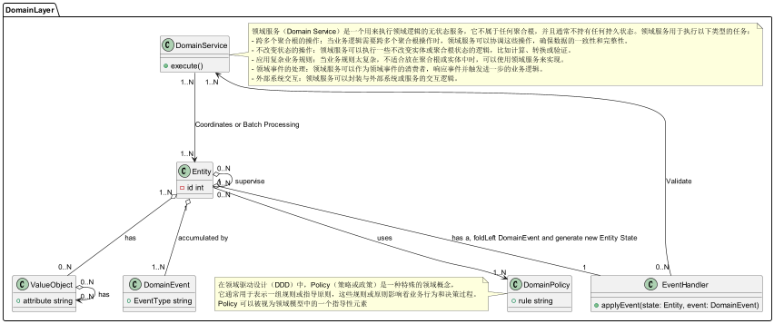

# Play Akka CQRS

[English](README.md) | 中文

## 快速上手
在启动前确保以下本地端口可用：
> - 2551，用于 Akka 远程通信和集群
> - 27015，用于事件日志
> - 3308，用于读取侧数据库

### 1.使用 Coursier 安装 Scala，可以按照以下命令行操作：
首先，安装 Coursier。你可以在终端中运行以下命令：

Linux
```bash
curl -fL https://github.com/coursier/launchers/raw/master/cs-x86_64-pc-linux.gz | gzip -d > cs
chmod +x cs
./cs setup
```
Windows
```shell
iex "& { $(irm https://git.io/coursier-cli-windows) }"

```

macOS
```bash
curl -fL https://github.com/coursier/launchers/raw/master/cs-x86_64-apple-darwin.gz | gzip -d > cs
chmod +x cs
./cs setup
```

然后，使用 Coursier 安装 Scala：
```bash
cs install scala
```

确保 Scala 已成功安装，检查版本：
```bash
scala -version
```
以上步骤将通过 Coursier 安装 Scala 并设置好环境。

### 2. 启动 Event Journal (MongoDB) 和 Read Side Database (MySQL)
```bash
docker-compose up -d
```
2. Launch Demo CQRS Service
```bash
sbt run
```

> 在 Apple Silicon Chipset 启动
> ```bash
> sbt -Djna.nosys=true clean run
> ```

### 3. 通过命令行对服务进行测试
```bash
# 获取账户A剩余额度
curl http://127.0.0.1:9000/balance/1c0d06fc-f108-4b62-b1f6-50eca6e50541

# 向账户A存储额度
curl -d {} http://127.0.0.1:9000/deposit/1c0d06fc-f108-4b62-b1f6-50eca6e50541/30.43

# 从账户A提现
curl -d {} http://127.0.0.1:9000/withdraw/1c0d06fc-f108-4b62-b1f6-50eca6e50541/10

# 获取账户B剩余额度
curl http://127.0.0.1:9000/balance/1048f264-73e7-4ac5-9925-7fe3ddb46491

# 从账户A到账户B转账
curl -d {} http://127.0.0.1:9000/transfer/1c0d06fc-f108-4b62-b1f6-50eca6e50541/1048f264-73e7-4ac5-9925-7fe3ddb46491/10

# 获取账户A剩余额度
curl http://127.0.0.1:9000/balance/1c0d06fc-f108-4b62-b1f6-50eca6e50541

# 获取账户B剩余额度
curl http://127.0.0.1:9000/balance/1048f264-73e7-4ac5-9925-7fe3ddb46491

```

## 概要
本项目试图建立一个 Scala 单一微服务代码项目的脚手架。它包含了以下一些特性：
- 洋葱架构，包含 domain, application 和 infrastructure 三个层次
- 采用 Akka 以实现标准 EventSourcing + CQRS 技术架构
  - 采用 Akka EventSourcedBehaviors 构建 DDD 的 Aggregate
  - 采用 Akka Projection 构建物化视图，以深度优化复杂 Queries
- 采用 PlayFramework 作 Web Server 定义 Controller.
- 简化实现了一个 SAGA 风格的分布式事务协调器，包含了满足多参与者的预留、提交、撤回的一致性与持久性操作，舍弃了原子性和隔离性

本文首先介绍脚手架中组件的概念与关系，然后再详细按照顺序给出代码示例。
> Scala 编程语言以超强的表达能力著称，这意味着更少的代码量。同时也意味着在与类似Claude3.5或ChatGPT类似人工智能交互过程中，耗费更少的 token。
> 除此之外，为了弥补人工智能在问题分解上的不足以及上下文窗口长度限制问题，脚手架中尽量将组件拆解的足够小，虽然增加了架构认知成本，但是获得了更好的模块化能力，例如更小的范围作本地推理、编码、调试、单元测试等。

## 洋葱架构内部组件与关系
### 原则
洋葱架构分离了业务复杂性与技术复杂性，同时在业务复杂性中又分离了业务领域复杂性和业务用例复杂性。大致对应关系为：
- 业务复杂性
  - 业务领域复杂性：领域层。
    - 与具体业务应用场景无关的企业业务领域逻辑。
  - 业务用例复杂性：应用层。
    - 落实企业业务领域规则具体场景或产品化，实现与用户或其他业务交互的落地逻辑。
    - 该脚手架由于采用了 EventSourcing，因此也引入了 Akka EventSourcedBehavior 系列部分 API
- 技术复杂性: 基础设施层。

### 部分目录结构示例
```bash
├── controllers
│         ├── HomeController.scala
│         └── filter
│             └── LoggingFilter.scala
├── net
│         └── imadz
│             ├── application                            # Onion Application Layer
│             │         ├── aggregates                   # Aggregations
│             │         │         ├── CreditBalanceAggregate.scala
│             │         │         ├── behaviors          # Aggregation Behaviors: Command Handlers
│             │         │         │         └── CreditBalanceBehaviors.scala
│             │         │         ├── factories          # Aggregation Factories
│             │         │         │         └── CreditBalanceAggregateFactory.scala
│             │         │         └── repository         # Aggregation Repositories
│             │         │             └── CreditBalanceRepository.scala
│             │         ├── projection                   # Projection for building Read side DB (materialized view)
│             │         │         ├── MonthlyIncomeAndExpenseSummaryProjection.scala
│             │         │         ├── MonthlyIncomeAndExpenseSummaryProjectionHandler.scala
│             │         │         ├── ScalikeJdbcSession.scala
│             │         │         ├── ScalikeJdbcSetup.scala
│             │         │         └── repository         # Projection Repository
│             │         │             └── MonthlyIncomeAndExpendsSummaryRepository.scala
│             │         ├── queries                      # Queries based on Aggregate or Materialized view implementing Read Model
│             │         │         ├── GetBalanceQuery.scala
│             │         │         └── GetRecent12MonthsIncomeAndExpenseReport.scala
│             │         └── services                     # Application Services
│             │             ├── CreateCreditBalanceService.scala
│             │             ├── DepositService.scala
│             │             ├── MoneyTransferService.scala
│             │             ├── WithdrawService.scala
│             │             └── transactor               # Utilities for application services
│             │                 ├── MoneyTransferSagaTransactor.scala
│             │                 ├── MoneyTransferSagaTransactorBehaviors.scala
│             │                 └── MoneyTransferTransactionRepository.scala
│             ├── common
│             │         ├── CborSerializable.scala
│             │         ├── CommonTypes.scala
│             │         ├── application
│             │         │         └── CommandHandlerReplyingBehavior.scala
│             │         └── serialization
│             │             └── ObjectIdOffsetSerializer.scala
│             ├── domain                                 # Onion Domain Layer
│             │         ├── entities                     # Domain Entities
│             │         │         ├── CreditBalanceEntity.scala
│             │         │         └── behaviors          # Domain Entity Behaviors: Event Handler
│             │         │             └── CreditBalanceEventHandler.scala
│             │         ├── policy                       # Enterprise/Business Policies
│             │         │         ├── AddInitialOnlyOncePolicy.scala
│             │         │         ├── DepositPolicy.scala
│             │         │         └── WithdrawPolicy.scala
│             │         ├── services                     # Domain Services
│             │         │         └── TransferDomainService.scala
│             │         └── values                       # Domain Value Objects
│             │             └── Money.scala
│             ├── infra                                  # Infra Utilities, can be extracted into dedicated project
│             │         └── saga                         # Saga Component
│             │             ├── ForSaga.scala
│             │             ├── SagaParticipant.scala
│             │             ├── SagaTransactionCoordinator.scala
│             │             ├── StepExecutor.scala
│             │             ├── handlers
│             │             │         ├── StepExecutorCommandHandler.scala
│             │             │         ├── StepExecutorEventHandler.scala
│             │             │         └── StepExecutorRecoveryHandler.scala
│             │             ├── repository
│             │             │         ├── SagaTransactionCoordinatorRepositoryImpl.scala
│             │             │         └── TransactionCoordinatorRepository.scala
│             │             └── serialization
│             │                 ├── AkkaSerializationWrapper.scala
│             │                 ├── SagaSerializer.scala
│             │                 └── SagaTransactionStepSerializer.scala
│             └── infrastructure                        # Onion Infrastructure Layer 
│                 ├── SuffixCollectionNames.scala
│                 ├── bootstrap                         # Components Bootstrap
│                 │         ├── CreditBalanceBootstrap.scala
│                 │         ├── MonthlyIncomeAndExpenseBootstrap.scala
│                 │         └── SagaTransactionCoordinatorBootstrap.scala
│                 ├── persistence                       # Event Adapters and Snapshot Adapters for Event Sourcing
│                 │         ├── CreditBalanceEventAdapter.scala
│                 │         ├── CreditBalanceSnapshotAdapter.scala
│                 │         ├── ParticipantAdapter.scala
│                 │         ├── SagaTransactionCoordinatorEventAdapter.scala
│                 │         └── StepExecutorEventAdapter.scala
│                 └── repositories                      # Repository Implementations for aggregates, projections and services 
│                     ├── aggregate
│                     │         └── CreditBalanceRepositoryImpl.scala
│                     ├── projection
│                     │         └── MonthlyIncomeAndExpenseSummaryRepositoryImpl.scala
│                     └── service
│                         └── MoneyTransferTransactionRepositoryImpl.scala
├── protobuf                                            # Protobuf files for akka remoting, akka persistence and so on.
│         ├── credits.proto
│         ├── saga_participant.proto
│         ├── saga_v2.proto
│         ├── saga_v2_test.proto
│         └── transactions.proto
└── views
    ├── index.scala.html
    └── main.scala.html
```

### 领域层组件


针对图中对象按照非严格的独立性从上到下，做简要介绍，想要深入了解需要阅读 DDD 或者 IDDD 两本经典：
- 值对象(ValueObject):
  - 不可变的对象,没有唯一标识符。它通过属性值来定义,如货币、日期等。

- 领域事件(DomainEvent):
  - 表示领域中发生的重要事件,可以触发其他操作或状态变化。同时领域事件是非常重要的微服务系统架构胶水，用于系统间传播业务变化，信息量远优越于数据库层面的CDC。

- 实体(Entity):
  - 有唯一标识符的对象。根实体(RootEntity)是聚合的核心,代表聚合的整体状态。

- 领域策略(DomainPolicy):
  - 定义领域规则和约束的对象,用于实现业务逻辑。

- 事件处理器(EventHandler):
  - 负责响应和处理领域事件的组件。

- 领域服务(DomainService):
  - 封装不属于实体或值对象的领域逻辑的服务。

关系:
- 实体和值对象是领域模型的基本构建块。
- 领域事件由实体或领域服务产生,由事件处理器处理。
- 领域策略应用于实体和值对象,确保业务规则的执行。
- 领域服务协调实体、值对象和领域策略的交互。

这些概念共同构成了领域驱动设计(DDD)的核心元素,用于建模复杂的业务领域。
### 应用层组件


# DDD和Akka Event Sourcing概念

- 聚合(Aggregate):
  - 封装了根实体(Root Entity)
  - 在Akka Event Sourcing中增加了技术复杂性，因此分离至应用层

- 命令(Command):
  - 聚合接受的操作协议

- 命令处理器(CommandHandler):
  - 处理发送到聚合的命令
  - 一般函数式签名表达 (Command, State) => Effect[Event, State]
  - 在本架构术语中对应的表达 (Command, RootEntity) => Effect[DomainEvent, RootEntity]

- 投影(Projection):
  - Akka Projection工厂, 用于构建CQRS物化视图

- 投影处理器(ProjectionHandler):
  - 由Akka Projection管理的事件处理器
  - 接受领域事件,完成ETL转换
  - 通过ProjectionRepository存储新的数据模型

- 投影仓库(ProjectionRepository):
  - 物化视图的仓库接口

- 查询(Query):
  - 用于业务查询

- 聚合工厂(AggregateFactory):
  - 构建聚合的工厂

- 聚合仓库(AggregateRepository):
  - 用于获取或保存聚合的仓库

- 应用服务(ApplicationService):
  - 在用例或复杂业务任务粒度上完成用户请求

- 流程处理器(ProcessHandler):
  - 根据系统中的业务变化发起或推进业务流程

- 领域事件发布器(DomainEventPublisher):
  - 用于发送领域事件到消息队列的接口

关系:
- 聚合包含命令和命令处理器
- 命令处理器将命令转换为领域事件
- 投影注册投影处理器
- 投影处理器使用投影仓库构建读侧数据库
- 应用服务分发命令和查询
- 查询从聚合模型或投影仓库读取数据
- 聚合仓库和工厂管理和构造聚合
- 投影使用聚合的标签和事件流
- 投影处理器和流程处理器消费领域事件
- 流程处理器可以加载和创建新的聚合

这些概念共同构成了一个基于DDD和Akka Event Sourcing的系统架构,实现了命令查询职责分离(CQRS)和事件溯源(Event Sourcing)模式。

### 基础设施层组件
> 对于微服务系统的组成部分，目前还不够完整，后续再增加更多相关特性例如回弹性、熔断器、限流、安全、日志聚合、业务埋点、APM监控、分布式追踪、背压、API版本控制、故障注入、配置管理、健康检查、Gatling进行性能测试、响应式数据库访问、Kafka集成、异步IO、还有部署CICD、Akka 服务发现和负载均衡、国际化

# 基础设施层(Infrastructure Layer)详细信息

基础设施层包含了系统的技术实现细节,主要包括以下几个部分:

- 事件溯源(Event Sourcing)
  - DomainEventProto: 领域事件的Protocol Buffers定义
  - SnapshotProto: 快照的Protocol Buffers定义
  - DomainEventPersistentAdapter: 领域事件持久化适配器
  - SnapshotPersistentAdapter: 快照持久化适配器
  - AggregateBootstrap: 聚合引导程序
  - ProjectionBootstrap: 投影引导程序

- 数据库仓库(Database Repository)
  - AggregateRepositoryImpl: 聚合仓库的实现
  - ProjectionRepositoryImpl: 投影仓库的实现

- RESTful服务
  - Controller: REST API控制器

- WebSocket服务
  - WebSocketController: WebSocket控制器

- gRPC服务(尚未实现)
  - ClientStub: gRPC客户端存根
  - ServerStub: gRPC服务器存根
  - gRPCMessageType: gRPC消息类型

- 消息传递(Messaging)
  - MessageProducer: 消息生产者
  - MessageConsumer: 消息消费者
  - MessageProtocol: 消息协议

- 依赖注入(Dependency Injection)
  - Injection: 特定框架相关的依赖注入

关键关系:
- AggregateRepositoryImpl和ProjectionRepositoryImpl实现了应用层定义的仓库接口
- Controller, WebSocketController和ServerStub使用ApplicationService
- MessageProducer实现了DomainEventPublisher接口
- DomainEventPersistentAdapter和SnapshotPersistentAdapter与Event Journal和Snapshot Journal交互
- 依赖注入(Injection)负责绑定和提供各种接口的实现实例

外部系统交互:
- 通过HTTP调用Controller
- 通过gRPC与ClientStub和ServerStub交互

数据存储:
- 关系型数据库用于非事件溯源的数据存储
- 读侧数据库用于查询优化
- 事件日志和快照日志用于事件溯源

消息队列:
- MessageProducer发送消息到消息队列
- MessageConsumer从消息队列接收消息

### 关于 Akka EventSourcing + CQRS
如前文所示，该脚手架采用了一个不同结构尝试，将 Aggregate 内部的与 Akka 无关的部分置于 Domain 层，而基于 Akka 的 Aggregate 部分放在 Application 层。
另外，在 Akka EventSourcing 过程中 Akka 事件与快照序列化采用了 protobuf 协议，在初始化引导注册通过了对应 Adapter。 
