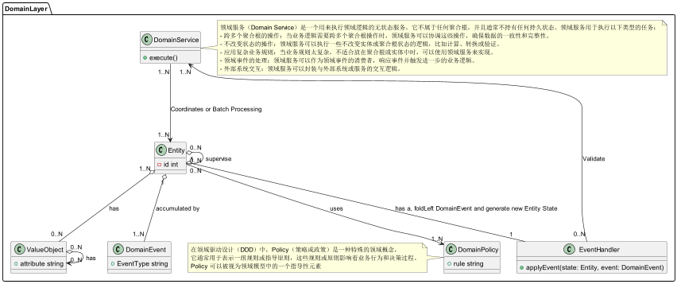
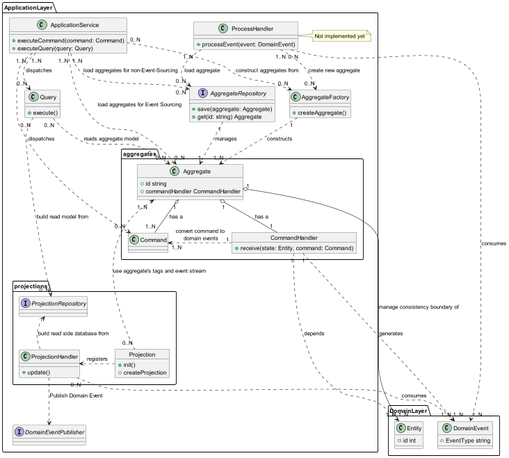
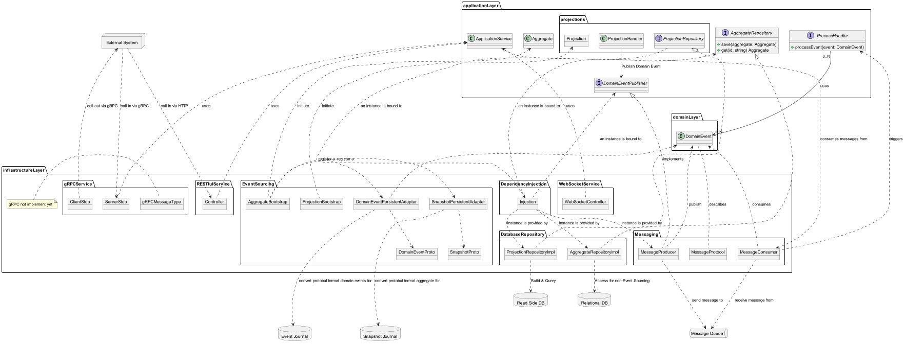

# Play Akka CQRS

[English](README.md) | [中文](README-zh.md)

## Quick Start

> Make sure following local ports is available before launching
> - 2551, for akka remoting and clustering
> - 27015, for event journal
> - 3308, for read side database

### 1. Install Scala using Coursier by following these command line steps:
   First, install Coursier. You can run the following commands in your terminal:

Linux
```bash
curl -fL https://github.com/coursier/launchers/raw/master/cs-x86_64-pc-linux.gz | gzip -d > cs
chmod +x cs
./cs setup
```
Windows
```shell
iex "& { $(irm https://git.io/coursier-cli-windows) }"

```

macOS
```bash
curl -fL https://github.com/coursier/launchers/raw/master/cs-x86_64-apple-darwin.gz | gzip -d > cs
chmod +x cs
./cs setup
```

Then, install Scala using Coursier:

```bash
cs install scala
```
Ensure Scala is successfully installed by checking the version:

```bash
scala -version
```
These steps will install Scala using Coursier and set up the environment.

### 2. Launch Event Journal (MongoDB) and Read Side Database (MySQL)

```bash
docker-compose up -d
```

### 3. Launch Demo CQRS Service

```bash
sbt run
```

> Running on Apple Silicon Chipset
> ```bash
> sbt -Djna.nosys=true clean run
> ```

### 4. Test service with Command Line

```bash
# Get the remaining balance of account A
curl http://127.0.0.1:9000/balance/1c0d06fc-f108-4b62-b1f6-50eca6e50541

# Deposit into account A
curl -d {} http://127.0.0.1:9000/deposit/1c0d06fc-f108-4b62-b1f6-50eca6e50541/30.43

# Withdraw from account A
curl -d {} http://127.0.0.1:9000/withdraw/1c0d06fc-f108-4b62-b1f6-50eca6e50541/10

# Get the remaining balance of account B
curl http://127.0.0.1:9000/balance/1048f264-73e7-4ac5-9925-7fe3ddb46491

# Transfer from account A to account B
curl -d {} http://127.0.0.1:9000/transfer/1c0d06fc-f108-4b62-b1f6-50eca6e50541/1048f264-73e7-4ac5-9925-7fe3ddb46491/10

# Get the remaining balance of account A
curl http://127.0.0.1:9000/balance/1c0d06fc-f108-4b62-b1f6-50eca6e50541

# Get the remaining balance of account B
curl http://127.0.0.1:9000/balance/1048f264-73e7-4ac5-9925-7fe3ddb46491
```

## Overview

This project aims to establish a scaffold for a Scala single microservice code project. It includes the following
features:

- Onion Architecture, which includes three layers: domain, application, and infrastructure.
- Akka is used to implement the standard EventSourcing + CQRS technical architecture.
    - Akka EventSourcedBehaviors are used to build DDD Aggregates.
    - Akka Projection is used to build materialized views to deeply optimize complex Queries.
- Play Framework is used as the Web Server to define Controllers.
- A simplified implementation of a SAGA-style distributed transaction coordinator is included, which includes
  consistency and persistence operations for multiple participants, abandoning atomicity and isolation.

This document first introduces the concepts and relationships of the components in the scaffold, and then provides
detailed code examples in order.

> The Scala programming language is known for its strong expressiveness, which means less code volume. It also means
> less tokens are consumed when interacting with artificial intelligence like Claude3.5 or ChatGPT.
> In addition, to make up for the shortcomings of artificial intelligence in problem decomposition and the limitation of
> context window length, the scaffold tries to decompose components into smaller parts as much as possible. Although it
> increases the cost of architectural cognition, it gains better modularity capabilities, such as smaller scope for local
> reasoning, coding, debugging, and unit testing.

## Onion Architecture Internal Components and Relationships

### Principles

The Onion Architecture separates business complexity from technical complexity, and within business complexity, it
further separates domain complexity from use case complexity. The general correspondence is as follows:

- Business Complexity
    - Domain Complexity: Domain Layer.
        - Enterprise business domain logic that is independent of specific business application scenarios.
    - Use Case Complexity: Application Layer.
        - The specific scenario or product implementation of the enterprise business domain rules, and the logic for
          interaction with users or other businesses.
        - Since this scaffold uses EventSourcing, it also introduces some of the Akka EventSourcedBehavior series of
          APIs.
- Technical Complexity: Infrastructure Layer.

### Partial Directory Structure Example

```bash
├── controllers
│         ├── HomeController.scala
│         └── filter
│             └── LoggingFilter.scala
├── net
│         └── imadz
│             ├── application                            # Onion Application Layer
│             │         ├── aggregates                   # Aggregations
│             │         │         ├── CreditBalanceAggregate.scala
│             │         │         ├── behaviors          # Aggregation Behaviors: Command Handlers
│             │         │         │         └── CreditBalanceBehaviors.scala
│             │         │         ├── factories          # Aggregation Factories
│             │         │         │         └── CreditBalanceAggregateFactory.scala
│             │         │         └── repository         # Aggregation Repositories
│             │         │             └── CreditBalanceRepository.scala
│             │         ├── projection                   # Projection for building Read side DB (materialized view)
│             │         │         ├── MonthlyIncomeAndExpenseSummaryProjection.scala
│             │         │         ├── MonthlyIncomeAndExpenseSummaryProjectionHandler.scala
│             │         │         ├── ScalikeJdbcSession.scala
│             │         │         ├── ScalikeJdbcSetup.scala
│             │         │         └── repository         # Projection Repository
│             │         │             └── MonthlyIncomeAndExpendsSummaryRepository.scala
│             │         ├── queries                      # Queries based on Aggregate or Materialized view implementing Read Model
│             │         │         ├── GetBalanceQuery.scala
│             │         │         └── GetRecent12MonthsIncomeAndExpenseReport.scala
│             │         └── services                     # Application Services
│             │             ├── CreateCreditBalanceService.scala
│             │             ├── DepositService.scala
│             │             ├── MoneyTransferService.scala
│             │             ├── WithdrawService.scala
│             │             └── transactor               # Utilities for application services
│             │                 ├── MoneyTransferSagaTransactor.scala
│             │                 ├── MoneyTransferSagaTransactorBehaviors.scala
│             │                 └── MoneyTransferTransactionRepository.scala
│             ├── common
│             │         ├── CborSerializable.scala
│             │         ├── CommonTypes.scala
│             │         ├── application
│             │         │         └── CommandHandlerReplyingBehavior.scala
│             │         └── serialization
│             │             └── ObjectIdOffsetSerializer.scala
│             ├── domain                                 # Onion Domain Layer
│             │         ├── entities                     # Domain Entities
│             │         │         ├── CreditBalanceEntity.scala
│             │         │         └── behaviors          # Domain Entity Behaviors: Event Handler
│             │         │             └── CreditBalanceEventHandler.scala
│             │         ├── policy                       # Enterprise/Business Policies
│             │         │         ├── AddInitialOnlyOncePolicy.scala
│             │         │         ├── DepositPolicy.scala
│             │         │         └── WithdrawPolicy.scala
│             │         ├── services                     # Domain Services
│             │         │         └── TransferDomainService.scala
│             │         └── values                       # Domain Value Objects
│             │             └── Money.scala
│             ├── infra                                  # Infra Utilities, can be extracted into dedicated project
│             │         └── saga                         # Saga Component
│             │             ├── ForSaga.scala
│             │             ├── SagaParticipant.scala
│             │             ├── SagaTransactionCoordinator.scala
│             │             ├── StepExecutor.scala
│             │             ├── handlers
│             │             │         ├── StepExecutorCommandHandler.scala
│             │             │         ├── StepExecutorEventHandler.scala
│             │             │         └── StepExecutorRecoveryHandler.scala
│             │             ├── repository
│             │             │         ├── SagaTransactionCoordinatorRepositoryImpl.scala
│             │             │         └── TransactionCoordinatorRepository.scala
│             │             └── serialization
│             │                 ├── AkkaSerializationWrapper.scala
│             │                 ├── SagaSerializer.scala
│             │                 └── SagaTransactionStepSerializer.scala
│             └── infrastructure                        # Onion Infrastructure Layer 
│                 ├── SuffixCollectionNames.scala
│                 ├── bootstrap                         # Components Bootstrap
│                 │         ├── CreditBalanceBootstrap.scala
│                 │         ├── MonthlyIncomeAndExpenseBootstrap.scala
│                 │         └── SagaTransactionCoordinatorBootstrap.scala
│                 ├── persistence                       # Event Adapters and Snapshot Adapters for Event Sourcing
│                 │         ├── CreditBalanceEventAdapter.scala
│                 │         ├── CreditBalanceSnapshotAdapter.scala
│                 │         ├── ParticipantAdapter.scala
│                 │         ├── SagaTransactionCoordinatorEventAdapter.scala
│                 │         └── StepExecutorEventAdapter.scala
│                 └── repositories                      # Repository Implementations for aggregates, projections and services 
│                     ├── aggregate
│                     │         └── CreditBalanceRepositoryImpl.scala
│                     ├── projection
│                     │         └── MonthlyIncomeAndExpenseSummaryRepositoryImpl.scala
│                     └── service
│                         └── MoneyTransferTransactionRepositoryImpl.scala
├── protobuf                                            # Protobuf files for akka remoting, akka persistence and so on.
│         ├── credits.proto
│         ├── saga_participant.proto
│         ├── saga_v2.proto
│         ├── saga_v2_test.proto
│         └── transactions.proto
└── views
    ├── index.scala.html
    └── main.scala.html
```

### Domain Layer Components



A brief introduction to the objects in the diagram from top to bottom in a non-strictly independent manner. For a deeper
understanding, it is necessary to read the classics DDD or IDDD:

- ValueObject:
    - Immutable objects, without unique identifiers. They are defined by property values, such as currency, dates, etc.

- DomainEvent:
    - Represents significant events that occur in the domain, which can trigger other operations or state changes.
      Domain events are also very important glue in the microservice system architecture, used to disseminate business
      changes between systems, with far superior information volume compared to CDC at the database level.

- Entity:
    - Objects with unique identifiers. The RootEntity is the core of the aggregate, representing the overall state of
      the aggregate.

- DomainPolicy:
    - Objects that define domain rules and constraints, used to implement business logic.

- EventHandler:
    - Components responsible for responding to and processing domain events.

- DomainService:
    - Services that encapsulate domain logic that does not belong to entities or value objects.

Relationships:

- Entities and value objects are the basic building blocks of the domain model.
- Domain events are generated by entities or domain services and are processed by event handlers.
- Domain policies are applied to entities and value objects to ensure the execution of business rules.
- Domain services coordinate the interaction between entities, value objects, and domain policies.

These concepts together form the core elements of Domain-Driven Design (DDD), used to model complex business domains.

### Application Layer Components



# DDD and Akka Event Sourcing Concepts

- Aggregate:
    - Encapsulates the Root Entity.
    - In Akka Event Sourcing, technical complexity is added, so it is separated into the Application Layer.

- Command:
    - The operational protocol accepted by the aggregate.

- CommandHandler:
    - Handles commands sent to the aggregate.
    - Generally expressed in a functional signature (Command, State) => Effect[Event, State].
    - In the architectural terminology of this framework, it corresponds to (Command, RootEntity) =>
      Effect[DomainEvent, RootEntity].

- Projection:
    - Akka Projection factory, used to build CQRS materialized views.

- ProjectionHandler:
    - Event handlers managed by Akka Projection.
    - Accept domain events, complete ETL transformation.
    - Store the new data model through the ProjectionRepository.

- ProjectionRepository:
    - The repository interface for materialized views.

- Query:
    - Used for business queries.

- AggregateFactory:
    - A factory for building aggregates.

- AggregateRepository:
    - A repository for obtaining or saving aggregates.

- ApplicationService:
    - Completes user requests at the granularity of use cases or complex business tasks.

- ProcessHandler:
    - Initiates or advances business processes based on business changes in the system.

- DomainEventPublisher:
    - An interface for sending domain events to a message queue.

Relationships:

- Aggregates contain commands and command handlers.
- Command handlers convert commands into domain events.
- Projections register projection handlers.
- Projection handlers use projection repositories to build read-side databases.
- Application services distribute commands and queries.
- Queries read data from the aggregate model or projection repository.
- Aggregate repositories and factories manage and construct aggregates.
- Projections use aggregate tags and event streams.
- Projection handlers and process handlers consume domain events.
- Process handlers can load and create new aggregates.

These concepts together form a system architecture based on DDD and Akka Event Sourcing, implementing Command Query
Responsibility Segregation (CQRS) and Event Sourcing patterns.

### Infrastructure Layer Components

> For the components of the microservice system, it is not yet complete, and more features such as resilience, circuit
> breakers, rate limiting, security, log aggregation, business embedding, APM monitoring, distributed tracing, back
> pressure, API version control, fault injection, configuration management, health checks, performance testing with
> Gatling, reactive database access, Kafka integration, asynchronous IO, and deployment CICD, Akka service discovery and
> load balancing, and internationalization will be added later.


# Infrastructure Layer (Infrastructure Layer) Details

The Infrastructure Layer contains the technical implementation details of the system, mainly including the following
parts:

- Event Sourcing
    - DomainEventProto: Protocol Buffers definition of domain events.
    - SnapshotProto: Protocol Buffers definition of snapshots.
    - DomainEventPersistentAdapter: Adapter for domain event persistence.
    - SnapshotPersistentAdapter: Adapter for snapshot persistence.
    - AggregateBootstrap: Aggregate bootstrap program.
    - ProjectionBootstrap: Projection bootstrap program.

- Database Repository
    - AggregateRepositoryImpl: Implementation of the aggregate repository.
    - ProjectionRepositoryImpl: Implementation of the projection repository.

- RESTful Services
    - Controller: REST API controller.

- WebSocket Services
    - WebSocketController: WebSocket controller.

- gRPC Services (Not yet implemented)
    - ClientStub: gRPC client stub.
    - ServerStub: gRPC server stub.
    - gRPCMessageType: gRPC message type.

- Messaging
    - MessageProducer: Message producer.
    - MessageConsumer: Message consumer.
    - MessageProtocol: Message protocol.

- Dependency Injection
    - Injection: Dependency injection related to specific frameworks.

Key Relationships:

- AggregateRepositoryImpl and ProjectionRepositoryImpl implement the repository interfaces defined in the Application
  Layer.
- Controller, WebSocketController, and ServerStub use ApplicationService.
- MessageProducer implements the DomainEventPublisher interface.
- DomainEventPersistentAdapter and SnapshotPersistentAdapter interact with the Event Journal and Snapshot Journal.
- Dependency injection (Injection) is responsible for binding and providing the implementation instances of various
  interfaces.

External System Interactions:

- Call Controller through HTTP.
- Interact with ClientStub and ServerStub through gRPC.

Data Storage:

- Relational databases for non-event sourcing data storage.
- Read-side databases for query optimization.
- Event logs and snapshot logs for event sourcing.

Message Queues:

- MessageProducer sends messages to the message queue.
- MessageConsumer receives messages from the message queue.

### About Akka EventSourcing + CQRS

As mentioned earlier, this scaffold adopts a different structure attempt, placing the parts of the Aggregate that are
unrelated to Akka in the Domain layer, and the Akka-based parts of the Aggregate in the Application layer.
In addition, during the Akka EventSourcing process, Akka events and snapshot serialization use the protobuf protocol,
and the corresponding Adapter is registered through the initialization bootstrap.

