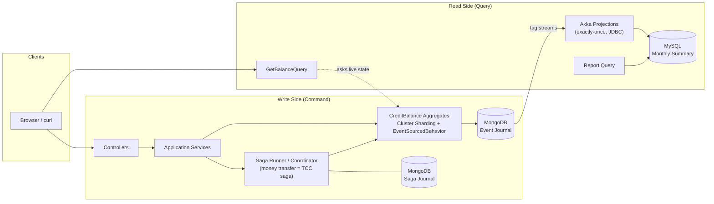

# Play Akka CQRS

**English** | [中文](README-zh.md)

[](https://www.scala-lang.org/)
[](https://akka.io/)
[](https://www.playframework.com/)
[](https://jdk.java.net/11/)
[](#testing)

A minimal-but-complete **DDD + CQRS + Event Sourcing** reference application built on **Akka Typed Cluster Sharding**, featuring a banking domain (accounts, deposits, withdrawals, transfers) driven end-to-end by a **TCC (Try-Confirm/Cancel) Saga engine** with a type-safe declarative DSL.

> **TL;DR** — Deposit and withdraw money through a CQRS write model (MongoDB event journal), watch read models materialize in MySQL via Akka Projections, and run cross-aggregate money transfers as fully event-sourced, crash-recoverable TCC sagas. A built-in Showcase lets you inject faults into a live saga and watch it retry, compensate, suspend, and recover.

---

## Table of Contents

- [Features](#features)
- [Architecture](#architecture)
- [Modules](#modules)
- [Quick Start](#quick-start)
- [HTTP API Reference](#http-api-reference)
- [The Saga Showcase](#the-saga-showcase)
- [Testing](#testing)
- [Documentation Map](#documentation-map)
- [Project Layout](#project-layout)
- [Tech Stack](#tech-stack)

## Features

| Area | What you get |
|---|---|
| **DDD tactical design** | Onion architecture: pure domain model (entities, value objects, invariant rules, domain service), application services, thin adapters. See the [DDD Guide](docs/DDD_GUIDE.md). |
| **CQRS** | Write side: cluster-sharded `EventSourcedBehavior` aggregates with a MongoDB journal. Read side: Akka Projections materialize MySQL read models (monthly income/expense summary) and saga business events. |
| **Event Sourcing** | Domain events serialized to Protobuf via event adapters; snapshots every 100 events; tag-based event streams feed projections. |
| **TCC Saga engine** | Try-Confirm/Cancel distributed transactions with per-step resilience (retries, timeouts, circuit breaker), parallel execution groups, reverse compensation, suspension + manual-fix recovery, single-step debugging. See the [Saga Guide](docs/SAGA_GUIDE.md). |
| **Crash recoverable** | Both aggregates *and* saga coordinators/executors are event-sourced: kill any node, restart, and in-flight transactions resume from the journal. |
| **Live observability** | Saga progress events stream over WebSocket (`/ws/saga/events`) into the Showcase UI. |

## Architecture


```mermaid
flowchart LR
    subgraph Clients
        B["Browser / curl"]
    end

    subgraph "Write Side (Command)"
        C["Controllers"] --> S["Application Services"]
        S --> A["CreditBalance Aggregates<br/>Cluster Sharding + EventSourcedBehavior"]
        S --> SG["Saga Runner / Coordinator<br/>(money transfer = TCC saga)"]
        SG --> A
        A --> J[("MongoDB<br/>Event Journal")]
        SG --- SJ[("MongoDB<br/>Saga Journal")]
    end

    subgraph "Read Side (Query)"
        J -- "tag streams" --> PR["Akka Projections<br/>(exactly-once, JDBC)"]
        PR --> M[("MySQL<br/>Monthly Summary")]
        Q1["GetBalanceQuery"] -. asks live state .-> A
        Q2["Report Query"] --> M
    end

    B --> C
    B --> Q1
```

Key consistency points:

- **Balance queries** ask the (sharded, in-memory) aggregate — always consistent with the write side.
- **Monthly reports** come from the MySQL read model — eventually consistent, updated by an exactly-once projection.
- **Money transfers** never touch two aggregates in one ACID transaction; instead a TCC saga reserves → confirms / compensates each account (see [Saga Guide](docs/SAGA_GUIDE.md#how-a-transfer-works)).

## Modules

| Module | Purpose |
|---|---|
| `root` | The Play web application: DDD banking domain (`app/net/imadz/{domain,application,infrastructure}`), controllers, projections, showcase. |
| `saga-core` | The reusable TCC saga engine (`net.imadz.infra.saga`): declarative DSL + sharded event-sourced coordinator/executors + protobuf persistence. Independently testable, zero dependency on Play. |
| `common-core` | Shared kernel: Akka Typed helpers (`CommandHandlerReplyingBehavior`, `CborSerializable`), the `InvariantRule` abstraction, ScalikeJDBC projection setup. |

## Quick Start

**Prerequisites:** JDK 11, sbt (any recent runner; project pins 1.4.9), Docker.

```bash
git clone <this-repo>
cd playAkkaCQRS

# 1. Start MongoDB (event journal, :27017) and MySQL (read side, :3308)
docker-compose up -d

# 2. Run the app (dev mode; HTTP on :9806)
sbt run
```

> Ports: HTTP **9806**, Akka artery **25561**, MongoDB **27017**, MySQL host **3308**.
> If you previously ran an *older* version of the compose stack, run `docker-compose down -v` once — the MySQL init script only executes on first volume creation.

### Try it (userId must be a UUID)

```bash
BASE=http://127.0.0.1:9806
ALICE=1c0d06fc-f108-4b62-b1f6-50eca6e50541   # any UUID
BOB=1048f264-73e7-4ac5-9925-7fe3ddb46491     # any UUID

# Deposit 100 CNY to Alice
curl -X POST "$BASE/deposit/$ALICE/100"
# => {"balances":[{"amount":100,"currency":"CNY"}]}

# Check balance (read from the live aggregate)
curl "$BASE/balance/$ALICE"

# Withdraw 30
curl -X POST "$BASE/withdraw/$ALICE/30"

# Transfer 10 Alice -> Bob — a TCC saga runs; fast completion returns the
# terminal result synchronously, otherwise 202 + transactionId
curl -X POST "$BASE/transfer/$ALICE/$BOB/10"

# Poll a transfer's durable saga status
curl "$BASE/transfer/<transactionId>"
```

### Run the acceptance suite

```bash
sbt acceptance        # alias for `test`: saga-core 53 cases (AC-1.1..AC-1.12 + AC-MF) + app tests
sbt sagaCore/test     # saga engine only — in-memory journal, no external services needed
```

## HTTP API Reference

### Banking

| Method | Path | Description |
|---|---|---|
| `GET` | `/balance/:userId` | Current balances (list of `{amount, currency}`) — asked from the live aggregate. `userId` **must be a UUID**. |
| `POST` | `/deposit/:userId/:amount` | Deposit (CNY). Returns the new balance confirmation. |
| `POST` | `/withdraw/:userId/:amount` | Withdraw (CNY). Fails if funds are insufficient. |
| `POST` | `/transfer/:from/:to/:amount` | Money transfer as a TCC saga. Returns the terminal `TransactionResult` when fast, else `202 {"transactionId": ...}`. |
| `GET` | `/transfer/:transactionId` | Durable saga status snapshot — survives restarts. |

### Saga Showcase & ops

| Method | Path | Description |
|---|---|---|
| `GET` | `/showcase` | Browser UI wired to the live event WebSocket. |
| `GET` | `/ws/saga/events` | WebSocket stream of saga progress events. |
| `POST` | `/api/saga/trigger-showcase/:singleStep` | Start a showcase saga (`singleStep=true` pauses before each group). |
| `GET` | `/api/saga/status/:transactionId` | Status snapshot (per-step, per-phase). |
| `GET` | `/api/saga/history/:transactionId` | Persisted saga event history. |
| `POST` | `/api/saga/inject-fault/:stepId/:behavior` | Set a participant script: `success` \| `failretryable` \| `failnonretryable` \| `timeout` \| `failtwicethensucceed`. |
| `POST` | `/api/saga/proceed/:transactionId` | Advance a paused (single-step) transaction by one group. |
| `POST` | `/api/saga/fix-step/:transactionId/:stepId/:phase` | Mark a step as externally fixed (journaled). |
| `POST` | `/api/saga/resume/:transactionId` | Re-drive a suspended transaction to its terminal state. |
| `POST` | `/api/saga/retry-phase/:transactionId` | Retry the current phase. |

## The Saga Showcase

Open `http://127.0.0.1:9806/showcase`, then drive the five demo paths:

| # | Path | How to trigger | What you should see |
|---|---|---|---|
| 1 | Group parallelism | Trigger (single-step off) | Step-A runs, then Step-B/Step-C prepare+commit; transaction `Completed`. |
| 2 | Self-healing retry | Inject `failtwicethensucceed` on Step-B, trigger | Step-B fails twice (retry #1, #2) then succeeds; transaction `Completed`. |
| 3 | Reverse compensation | Inject `failnonretryable` on Step-B, trigger | Already-prepared steps get compensated; transaction `Failed`. |
| 4 | Suspension + manual fix | Inject `failnonretryable` on **Step-C**, trigger, wait for `Suspended`, reset Step-C, `fix-step` + `resume` | Transaction reaches terminal `Failed` ("transaction failed but compensated"). |
| 5 | Single-step debugging | Trigger with `singleStep=true` | Transaction pauses before each group; use `proceed` to advance. |

The equivalent REST walkthrough is scripted in [`docs/SAGA_GUIDE.md`](docs/SAGA_GUIDE.md#showcase-walkthrough).

## Testing

| Suite | Cases | Needs external services? |
|---|---|---|
| `saga-core` acceptance + unit (`sbt sagaCore/test`) | 53 — covers acceptance criteria **AC-1.1 … AC-1.12** and **AC-MF** (manual-fix recovery) | No — in-memory persistence testkit |
| App tests (`sbt test`) | 9 — command-helper behavior | No |

`AC-1.x` are the engine's acceptance criteria (idempotent start, crash recovery, generation guards, definition-drift protection, resilience activation, serialization bindings, runner completion bridge, …). The full matrix lives in the [Saga Guide](docs/SAGA_GUIDE.md#acceptance-criteria).

## Documentation Map

| Document | Content |
|---|---|
| [docs/DDD_GUIDE.md](docs/DDD_GUIDE.md) / [中文](docs/DDD_GUIDE-zh.md) | **How DDD concepts land in this codebase**: every tactical pattern (value object, aggregate root, invariant rule, domain service, repository, factory, projection…) mapped to exact files, with counts and code excerpts. |
| [docs/SAGA_GUIDE.md](docs/SAGA_GUIDE.md) / [中文](docs/SAGA_GUIDE-zh.md) | **The TCC saga engine**: DSL in 4 steps, resilience policies, execution groups, ops & manual intervention, persistence (saga_v3 protobuf), acceptance criteria, showcase walkthrough. |
| [saga-core/README.md](saga-core/README.md) | 中文 quick reference for the saga-core module. |
| [docs/SAGA_ENGINE_README.md](docs/SAGA_ENGINE_README.md) | Historical v2.0 engine whitepaper (superseded by the guide above; kept for the step-by-step integration checklist). |
| `docs/*.puml` | PlantUML sequence diagrams (coordinator, step executor, saga lifecycle). |
| `knowledge_base/` | Per-artifact coding conventions used when scaffolding new code. |

## Project Layout

```
playAkkaCQRS
├── app/                                  # Play application (root module)
│   ├── controllers/                      #   HTTP endpoints (HomeController, ShowcaseController)
│   ├── views/                            #   Server-rendered pages (incl. Saga Showcase UI)
│   └── net/imadz/
│       ├── domain/                       # ← pure business logic (13 files)
│       │   ├── entities/                 #    CreditBalance state + 7 domain events
│       │   ├── entities/behaviors/       #    event → state evolution (pure function)
│       │   ├── invariants/               #    9 invariant rules (Deposit/Withdraw/Reserve/…)
│       │   ├── services/                 #    TransferDomainService
│       │   └── values/                   #    Money value object
│       ├── application/                  # ← use cases (22 files)
│       │   ├── aggregates/               #    aggregate wiring: protocol, behaviors, factory, repository
│       │   ├── services/                 #    Deposit/Withdraw/Create/MoneyTransfer services
│       │   │   └── transactor/           #    TCC participants + saga definitions
│       │   ├── queries/                  #    balance & monthly-report queries
│       │   └── projection/               #    read-side projections (MySQL summary, saga events)
│       ├── infrastructure/               # ← adapters (11 files)
│       │   ├── bootstrap/                #    startup wiring (sharding, projections, saga engine)
│       │   ├── persistence/              #    event/snapshot adapters (Protobuf)
│       │   └── repositories/             #    aggregate + read-side repository impls
│       └── modules/                      #    Guice bootstrap module
├── saga-core/                            # TCC saga engine (independent module)
│   └── src/main/scala/net/imadz/infra/saga/
│       ├── dsl/                          # SagaDefinition, SagaStep, SagaRunner, SagaRegistry…
│       ├── handlers/                     # StepExecutor command/event handlers
│       ├── persistence/                  # journal event adapters (saga_v3 protobuf)
│       └── …                             # coordinator, step executor, participant SPI
├── common-core/                          # shared kernel (invariant rule SPI, serialization)
├── conf/                                 # application/cluster/persistence/projection configs, routes, DDL
├── docs/                                 # guides (DDD, saga), diagrams, historical whitepaper
├── docker-compose.yaml                   # MongoDB 6 + MySQL 8 for local runs
└── build.sbt                             # 3 modules; `acceptance` alias; dev port 9806
```

## Tech Stack

| Layer | Technology |
|---|---|
| HTTP | Play Framework 2.8.18 (Akka HTTP backend), server-rendered Twirl views + WebSocket |
| Concurrency / clustering | Akka Typed 2.6.20 — Cluster Sharding, Cluster Singleton-free design, Artery remoting (25561) |
| Persistence | akka-persistence-mongo (journal + snapshots) → MongoDB 6 |
| Read side | Akka Projections 1.2.5 (JDBC, exactly-once) → MySQL 8 via ScalikeJDBC + HikariCP |
| Serialization | Protobuf (scalapb) event adapters for journals; jackson-cbor for cluster messages |
| Saga | `saga-core` — TCC, event-sourced, sharded (see [Saga Guide](docs/SAGA_GUIDE.md)) |
| Build / test | sbt 1.4.9, ScalaTest 3.2.15, akka persistence testkit, sbt-protoc |
