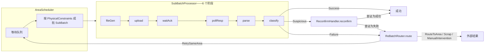

# ChainDsl 指南 — 批处理链组件引擎与声明式 DSL（`dag-engine-core` + `net.imadz.m25`）

[English](CHAINDSL_GUIDE.md) | 中文

ChainDsl 是本仓库的 **M2.5+ 批处理链引擎**：一组可组合、与框架无关的标准组件，驱动"一批业务物品"走完一个**外部系统交互周期**——生成文件 → 上传 → 等确认 → 轮询结果 → 解析 → 分类 → 可疑复核 → 失败路由。六个机械阶段由 **monarch-core**（`net.imadz.monarch.Monarch`）驱动——一个独立的可断点续跑阶段队列引擎，以帝王斑蝶命名：开放阶段队列（完全变态）、游标恢复（滞育——在检查点暂停、从暂停处精确续跑）、世代号（跨代迁徙——路线比任何个体长寿）。组件之上是声明式 DSL（`ChainDsl.define`），让链路配置读起来像业务参数表；再配一个事件溯源的持久化包装（`ChainExecutionActor`）提供崩溃恢复。

其他指南：[README](../README.md) · [Saga 指南](SAGA_GUIDE-zh.md) · 旧银行领域指南：[DDD_GUIDE-zh.md](legacy/DDD_GUIDE-zh.md)

引擎自身的文档：[monarch-core/README.md](../monarch-core/README.md)。

---

## 目录

1. [问题背景：为什么要有 ChainDsl](#1-问题背景为什么要有-chaindsl)
2. [架构：两层结构](#2-架构两层结构)
3. [批次生命周期](#3-批次生命周期)
4. [代码快速上手](#4-代码快速上手)
5. [核心概念与文件地图](#5-核心概念与文件地图)
6. [三分类闭环](#6-三分类闭环)
7. [失败路由与重新成批](#7-失败路由与重新成批)
8. [调度与物理约束](#8-调度与物理约束)
9. [模板：同一套组件，不同的业务](#9-模板同一套组件不同的业务)
10. [持久化包装：ChainExecutionActor](#10-持久化包装chainexecutionactor)
11. [已知限制](#11-已知限制)

---

## 1. 问题背景：为什么要有 ChainDsl

一大类业务流程共享同一个**骨架**：把一批物品通过文件交换交给外部系统，等它处理完，拉回结果，再把每个物品分拣为成功 / 失败 / 可疑。本仓库里的三个实例：

| | 充值（M1 银行） | 申购（M1 银行） | Fab 设备区（M3） |
|---|---|---|---|
| 传输方式 | SFTP 文件到银行 | SFTP 文件到理财平台 | HTTP recipe 上传 / 结果拉取 |
| 成功码 | `OK` | `OK` | 晶圆 CD 在规格内 |
| 失败码 | `BALANCE_INSUFFICIENT` | `QUOTA_EXCEEDED` | CD 超规格 |
| 可疑码 | `TIMEOUT` | `TIMEOUT`、`PARTIAL` | 边界量测值 |

M2 的做法：每条业务生成一套专属 EventSourcedBehavior FSM（30+ Java 文件、每条链 7 个 Actor）。M2.5 模板的做法：563 行模板生成 6 个 FSM——仍是代码生成，且各链有独立协议类型。M2.5+ 把它倒了过来：**一套标准组件库；一条业务链只是一组参数**（约 20 行配置、零代码生成、修 bug 只改一处）。

## 2. 架构：两层结构

```
┌──────────────────────────── app/（本仓库的 Play 应用） ────────────────────────────┐
│  net.imadz.m25.business   ChainDsl（声明式构建器）· ChainTemplates（充值/申购/      │
│                           设备区预设模板）                                          │
│  net.imadz.m25.pipeline    阶段实现：FileGenStage、SftpUploadStage、               │
│                           SftpPollStage、ResponseParseStage                        │
│  net.imadz.m25.binding     外部网关绑定（sftp/core/p2b）+ 短信模板                  │
│  net.imadz.m25.demo        M25PlusDemo——用 Mock 组装充值与申购两条链               │
│  application.component.chain  ChainExecutionActor（事件溯源包装）                  │
│                           FabChainExecutor、FabMeasurementClassifier（M3 复用）     │
└────────────────────────────────────────┬───────────────────────────────────────────┘
                                         │ 只依赖 scala.concurrent.Future
┌──────────── monarch-core/（引擎，零 Akka）+ dag-engine-core/ ───────────────────────┐
│  net.imadz.monarch (monarch-core)                                                    │
│    Monarch              可断点续跑阶段队列引擎：游标恢复、世代号、开放队列           │
│  net.imadz.m25.component                                                             │
│    SubBatchPipeline     6 个阶段接口 + 数据契约                                      │
│    BankChain            六阶段的 Monarch 队列（现行执行器）                          │
│    SubBatchProcessor    legacy for 推导执行器（M25PlusDemo 教学保留）                │
│    ResultClassifier     三分类 + ErrorCodeBasedClassifier 通用实现                   │
│    ReconfirmHandler     通过外部查证落定"可疑"项                                     │
│    ReBatchRouter        失败路由决策（Process Manager 模式）                         │
│    AreaScheduler        PhysicalConstraints 约束下的窗口式成批                       │
└──────────────────────────────────────────────────────────────────────────────────────┘
```

`monarch-core`（引擎）**零 Akka 依赖**——组件全是 trait + 数据 case class，返回 `Future`。正因如此，同一套组件既能被分片 Actor 使用，也能被 Play Controller 或 Fab 流水线直接复用。`BankChain.monarch(pipeline, hooks, runToken)` 是现行执行入口；`SubBatchProcessor` 为教学演示保留的 legacy 执行器。

## 3. 批次生命周期



一个 `SubBatch` 走完整趟得到 `SubBatchResult` =（成功， 失败， 可疑）三元组。可疑项由复核处理器落定（任何 item 都不会**停留在**可疑状态）；失败项拿到路由决策；`RetrySameArea` 决策以 `ItemSource.ReBatch` 重新提交进调度队列——闭环完成。

## 4. 代码快速上手

用 DSL 声明一条链（`app/net/imadz/m25/business/ChainDsl.scala`）：

```scala
import scala.concurrent.duration._

val recharge: ChainDsl.ChainDefinition[RechargeItem] =
  ChainDsl.define("recharge") { c =>
    c.fileGen  (myFileGenerator)          // FileGenerator[RechargeItem]
    c.upload   (mySftpUploader)           // FileUploader
    c.waitAck  (myAckWaiter)              // AckWaiter
    c.pollResp (myResponsePoller)         // ResponsePoller
    c.parse    (myXmlParser)              // ResponseParser[Raw]
    c.classify (ChainDsl.errorCodeClassifier[Raw, RechargeItem](
        extractCodeFn = _.code,
        associateFn   = (raw, items) => items.find(items.contains),
        mapping = ErrorCodeMapping(
          successCodes    = Set("OK"),
          failureCodes    = Map("BALANCE_INSUFFICIENT" -> NextStep.Scrap),
          suspiciousCodes = Set("TIMEOUT", "NETWORK_ERROR"))))
    c.onFailure { r =>
      r.maxRetries(3)
      r.cooldown(5.minutes)
      r.when("TIMEOUT") { NextStep.RetrySameArea(5.minutes) }
      r.otherwise       { NextStep.ManualIntervention("UNKNOWN_ERROR") }
    }
    c.scheduling { s =>
      s.minBatchSize(1); s.maxBatchSize(100); s.batchWindow(10.minutes)
    }
  }

// 端到端跑一个批次（分类 → 复核 → 路由已帮你接好）
val result: Future[SubBatchResult[Classification[RechargeItem]]] =
  recharge.processBatch(items)
```

或直接用预设模板（`ChainTemplates.scala`）：

```scala
val recharge = ChainTemplates.recharge(pipeline)          // 银行预设
val purchase = ChainTemplates.purchase(pipeline)          // 只有错误码不同
val area     = ChainTemplates.equipmentArea("LITHO-01",   // Fab 设备区（带载体约束）
               pipeline, errorMapping, routerPolicy,
               PhysicalConstraints(minBatchSize = 25, carrierCapacity = 25))
```

`ChainDsl.define` **快速失败**：六个阶段缺任何一个，在 **build 时**就抛 `IllegalStateException("[recharge] fileGen not configured")`，而不是运行到一半才炸。没配复核处理器时，会安装一个 `NoopReconfirmHandler`，把可疑项保守地降级为失败。

## 5. 核心概念与文件地图

| 概念 | 所在文件 | 一句话说明 |
|---|---|---|
| `SubBatchPipeline[Item, Raw]` | `dag-engine-core/.../SubBatchPipeline.scala` | 6 个阶段实现的聚合 case class |
| `FileGenerator` / `GeneratedFile` | 同上 | items → 传输文件（localPath、byteSize、encoding） |
| `FileUploader` / `UploadReceipt` | 同上 | 把文件推给外部系统 |
| `AckWaiter` / `AckResult` | 同上 | `AckReceived` / `AckTimeout(ms)` / `AckRejected(reason)` |
| `ResponsePoller` / `PollResult` | 同上 | `ResponseReady(file)` / `PollTimeout(attempts, ms)` / `PollError(cause)` |
| `ResponseParser[Raw]` | 同上 | 响应文件 → 原始结果序列 |
| `ResultClassifier[Raw, Item]` | `ResultClassifier.scala` | 原始结果 → 每个 item 的 `Classification` |
| `ErrorCodeBasedClassifier` | 同上 | 由 `ErrorCodeMapping` 驱动的可复用实现 |
| `Classification` = `Success`/`Failure`/`Suspicious` | 同上 | 每个 item 的三分类结论 |
| `ReconfirmHandler` / `VerifyingReconfirmHandler` | `ReconfirmHandler.scala` | 向权威数据源查证落定可疑项；`StillUncertain` ⇒ 保守按 `Failure` |
| `ReBatchRouter` / `PolicyBasedReBatchRouter` | `ReBatchRouter.scala` | 失败 → `RoutingDecision(item, NextStep, reason)` |
| `NextStep` | 同上 | `RetrySameArea(delay)` / `RouteToArea(area, recipe)` / `ManualIntervention(ticket)` / `Scrap` |
| `ReBatchPolicy` | 同上 | `maxRetries` + `actionMap`（错误码 → NextStep）+ `defaultCooldown` |
| `AreaScheduler` / `WindowedAreaScheduler` | `AreaScheduler.scala` | `PhysicalConstraints` 约束下的 FIFO 窗口式成批 |
| `SubBatch` / `SubBatchResult` | 同上 | 批次入 / 三分类结果出 |
| `ChainDsl` / `ChainDefinition` | `app/.../business/ChainDsl.scala` | 声明式构建器；`processBatch` 已接好分类→复核→路由 |
| `ChainTemplates` | `app/.../business/ChainTemplates.scala` | 充值 / 申购 / 设备区预设 |
| 具体阶段实现 | `app/.../m25/pipeline/*.scala` | 基于 SFTP 的 fileGen/upload/poll/parse |
| `BankStage` / `BankChainState` / `BankChain` | `dag-engine-core/.../BankChain.scala` | 六阶段的 Monarch 队列 + 单一穿透状态 + metadata 推导 |
| `ChainExecutionActor` | `dag-engine-core/.../ChainExecutionActor.scala` | 事件溯源包装（见 §10） |
| `Monarch` / `RunRegistry` | `monarch-core`（独立模块） | 可断点续跑的阶段队列引擎本体——零 Akka，可发布 Maven Central |

## 6. 三分类闭环

下游一切行为都由 `ResultClassifier` 给出的逐 item 结论驱动：

- **Success**——正常流出链路（下游通知、Fab 下一站……）。
- **Failure**——携带 `FailureReason(code, message, suggestedAction)`。路由时 `suggestedAction`（来自 `ErrorCodeMapping.failureCodes`）优先，其次路由器的 `ReBatchPolicy.actionMap`，最后兜底 `RetrySameArea(defaultCooldown)`。
- **Suspicious**——**必须在链内落定**。`VerifyingReconfirmHandler.verify` 向权威数据源查证（例如银行超时的转账查核心 API）。`VerifiedSuccess` / `VerifiedFailure` 直接落定；`StillUncertain` 保守按 `Failure` 处理、进入路由。没配置处理器时，`NoopReconfirmHandler` 以 `"Unresolved: …"` 为由把可疑项记为失败。

有了这个闭环，引擎才能吸收外部系统的各种怪异状态（文件部分损坏、超时结果不明），而不需要为每条业务写特例。

## 7. 失败路由与重新成批

`PolicyBasedReBatchRouter`（Process Manager 模式）把失败变成决策：

1. `context.retryCount >= policy.maxRetries` ⇒ `ManualIntervention("MAX_RETRY_EXCEEDED-<code>")`——转人工工单，绝不无限重试。
2. 否则按序取动作：`FailureReason.suggestedAction` → `policy.actionMap(code)` → `RetrySameArea(defaultCooldown)`。
3. `ChainDefinition.processBatch` 执行本地能执行的决策：`RetrySameArea` 的 item 以 `ItemSource.ReBatch(fromArea)` 重新提交进调度队列；`RouteToArea` / `Scrap` / `ManualIntervention` 交给宿主应用处理（它们跨越设备区/系统边界）。

`ReBatchPolicy.salarySavingDefault` 是现成的银行策略（余额不足 ⇒ Scrap，超时 ⇒ 5 分钟后重试，网络错误 ⇒ 30 秒后重试）。

## 8. 调度与物理约束

`WindowedAreaScheduler` 决定**何时**成批、**成多大**：

- `submit(items, source)` 追加进 FIFO 队列；`schedule()` 吐出就绪批次。
- 设了 `carrierCapacity`（如 25 片装一个 FOUP）时以它为有效批次上限，否则用 `maxBatchSize`。
- 队列量小于 `minBatchSize` 且还在 `batchWindow` 内 → 继续等；超窗 → 强制发批。
- 超大的排队批次会在有效上限处被切割。
- 覆写 `splitReady` 可实现领域化的分组（如同一 FOUP 绝不混 recipe）。

调度器刻意**不管时间**（没有内部定时器）：由宿主驱动 `schedule()`——调度 Actor、定时任务或测试都可以。

## 9. 模板：同一套组件，不同的业务

`ChainTemplates` 展示了组件化路线的经济性。充值与申购**只有** `ErrorCodeMapping` 和路由策略不同——流水线本身一字节不差：

| 模板 | chainId | failureCodes | suspiciousCodes |
|---|---|---|---|
| `recharge(pipeline)` | `recharge` | `BALANCE_INSUFFICIENT → Scrap` | `TIMEOUT`、`NETWORK_ERROR` |
| `purchase(pipeline)` | `purchase` | `QUOTA_EXCEEDED → Scrap` | `TIMEOUT`、`PARTIAL` |
| `equipmentArea(areaId, …)` | 设备区 ID | 调用方提供 | 调用方提供 |

`equipmentArea` 是 M3 Fab 变体：HTTP 取代 SFTP、量测值范围分类取代银行错误码、严格的载体约束（FOUP 容量、禁混 recipe）。app 层的 `FabMeasurementClassifier` 就是 `ErrorCodeBasedClassifier` 的量测版兄弟。

历史上新增一条业务链意味着生成一族新 FSM（M2）或跑一次代码生成器（M2.5 模板）；M2.5+ 里它只是一段 `ChainDsl.define`——约 20 行业务参数。

## 10. 持久化包装：ChainExecutionActor

`dag-engine-core/.../ChainExecutionActor.scala` 把六阶段链路（现由 **Monarch 引擎**（monarch-core）经 `BankChain` 驱动）包进 `EventSourcedBehavior`，让链路具备崩溃恢复能力：

- **协议**：`StartExecution(batchId, items, replyTo)`；内部命令 `PhaseCompleted(phase, metadata, snapshot)`、`PipelineSucceeded`、`PipelineFailed(phase, reason)`。
- **事件**：`Started`、`PhaseDone(phase, ts, metadata, snapshot)`（每阶段一条、按完成顺序排列——即游标；snapshot 携带阶段后置状态，恢复时可从链中段断点续跑）、`AllCompleted`、`ExecutionFailed`。
- **状态**：`Idle → Executing(completedPhases, lastState) → Completed | Failed`。
- **恢复**：`Executing` 状态下收到 `RecoveryCompleted` 时，先注册新的 `RunRegistry` 世代（崩溃前的旧 Future 链在下一个阶段边界静默终止），再经 `itemLoader(batchId)` 重载 items，最后 `monarch.resumeFromIndex(state, completedPhases.size)`——只重跑断点之后的阶段。
- **分片**：注册在 `EntityTypeKey("m25-chain-executor")` 下、以 `chainId` 为实体键——每条业务链一个分片实体。

Actor 是**持久性边界**；Monarch 引擎保持纯 Future 队列。这与 Fab 移植版（`FabPipelineExecutionActor` + `FabPipelineProcessor`）在生产化 `/fab-demo/m35` 自愈演示中跑的是同一模式。

## 11. 已知限制

如实列出，方便你评估采用：

1. **Ack/poll 失败终止的是整批**而非单个 item：`AckTimeout`/`AckRejected`/`PollTimeout`/`PollError` 会抛出已分类的 `StageFailedException`（ACK_TIMEOUT / ACK_REJECTED / POLL_TIMEOUT / POLL_ERROR）；宿主未配置 `FailureInterceptor` 时整个运行失败（有意为之——文件交换要么成功要么没成功）。item 级的三分类从响应文件解析成功后才开始。
3. **`NoopReconfirmHandler` 有损**：没有真实查证器时，可疑项一律变失败。生产环境务必配置 `VerifyingReconfirmHandler`。
4. **`WindowedAreaScheduler` 无持久化**：等待队列在内存里，时间由宿主驱动。多节点成批需要自行协调。
4. **飞行中的副作用是至少一次**：崩溃前刚完成的阶段，恢复后会重执行；下游必须幂等（恢复设计正是建立在这个契约上）。

---

*playAkkaCQRS 学习仓库的一部分——里程碑地图（M1 DDD → M2 DAG → M2.5+ ChainDsl → M3 Fab）见 [README](../README.md)。*
