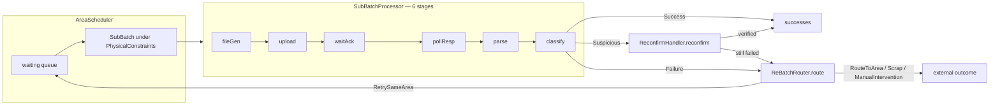

# ChainDsl Guide — The Batch-Chain Component Engine & Declarative DSL (`dag-engine-core` + `net.imadz.m25`)

English | [中文](CHAINDSL_GUIDE-zh.md)

ChainDsl is the **M2.5+ batch-chain engine**: a small library of composable, framework-agnostic components for driving a *batch of business items* through an *external-system interaction cycle* — generate file → upload → wait for ack → poll response → parse → classify → reconfirm suspicious → route failures. The six mechanical stages run on **monarch-core** (`net.imadz.monarch.Monarch`), a standalone resumable stage-queue engine named for the monarch butterfly: an open stage queue (metamorphosis), cursor-based resume (diapause — suspend at a checkpoint, continue exactly there), and generation tokens (migration across generations — the route outlives any individual runner). On top sits a declarative DSL (`ChainDsl.define`) so a chain reads like business configuration, plus event-sourced persistence wrappers for crash recovery.

Other guides: [README](../README.md) · [Saga Guide](SAGA_GUIDE.md) (EN) / [Saga 指南](SAGA_GUIDE-zh.md) (中文) · Legacy banking-domain guide: [DDD_GUIDE.md](legacy/DDD_GUIDE.md)

The engine's own documentation: [monarch-core/README.md](../monarch-core/README.md).

---

## Table of Contents

1. [The Problem: Why ChainDsl Exists](#1-the-problem-why-chaindsl-exists)
2. [Architecture: Two Layers](#2-architecture-two-layers)
3. [Batch Lifecycle](#3-batch-lifecycle)
4. [Quick Start in Code](#4-quick-start-in-code)
5. [Core Concepts & File Map](#5-core-concepts--file-map)
6. [The Three-Way Classification Loop](#6-the-three-way-classification-loop)
7. [Failure Routing & Re-batching](#7-failure-routing--re-batching)
8. [Scheduling & Physical Constraints](#8-scheduling--physical-constraints)
9. [Templates: Same Components, Different Business](#9-templates-same-components-different-business)
10. [Persistence Wrapper: ChainExecutionActor](#10-persistence-wrapper-chainexecutionactor)
11. [Known Limitations](#11-known-limitations)

---

## 1. The Problem: Why ChainDsl Exists

A family of business flows share the *same skeleton*: hand a batch of items to an external system through a file exchange, wait for it to process them, pull the results back, and sort each item into success / failure / suspicious. Two concrete examples in this repo:

| | Recharge (M1 banking) | Purchase (M1 banking) | Fab equipment area (M3) |
|---|---|---|---|
| Transport | SFTP file to bank | SFTP file to wealth platform | HTTP recipe up / result down |
| Success | `OK` | `OK` | wafer CD in spec |
| Failure | `BALANCE_INSUFFICIENT` | `QUOTA_EXCEEDED` | CD out of spec |
| Suspicious | `TIMEOUT` | `TIMEOUT`, `PARTIAL` | borderline measurement |

The M2 approach generated a dedicated set of EventSourcedBehavior FSMs per business (30+ Java files, 7 actors per chain). The M2.5 template approach generated 6 FSMs from a 563-line template — still code generation with per-chain protocol types. M2.5+ inverts it: **one standard component library; a business chain is just parameters** (~20 lines of configuration, zero generated code, one place to fix bugs).

## 2. Architecture: Two Layers

```
┌─────────────────────────────── app/ (this repo's Play app) ──────────────────────────────┐
│  net.imadz.m25.business   ChainDsl (declarative builder) · ChainTemplates (recharge/     │
│                           purchase/equipmentArea presets)                                │
│  net.imadz.m25.pipeline    Concrete stage impls: FileGenStage, SftpUploadStage,          │
│                           SftpPollStage, ResponseParseStage                              │
│  net.imadz.m25.binding     External gateway bindings (sftp/core/p2b) + SMS templates     │
│  net.imadz.m25.demo        M25PlusDemo — assembles recharge & purchase from mocks        │
│  net.imadz.application.component.chain  ChainExecutionActor (event-sourced wrapper)      │
│                           FabChainExecutor, FabMeasurementClassifier (M3 reuse)          │
└──────────────────────────────────────────┬───────────────────────────────────────────────┘
                                           │ depends only on scala.concurrent.Future
┌──────────────────────────── dag-engine-core/ (no Akka dependency) ───────────────────────┐
│  net.imadz.m25.component                                                                 │
│    SubBatchPipeline     the 6 stage interfaces + their data contracts                    │
│    SubBatchProcessor    executes the stage sequence for one batch                        │
│    ResultClassifier     three-way classification + ErrorCodeBasedClassifier              │
│    ReconfirmHandler     resolves Suspicious items via external verification              │
│    ReBatchRouter        failure routing decisions (Process Manager)                      │
│    AreaScheduler        windowed re-batching under PhysicalConstraints                   │
└───────────────────────────────────────────────────────────────────────────────────────────┘
```

`dag-engine-core` has **no Akka dependency** — every component is a trait plus data case classes returning `Future`. That is what makes the same components reusable from a sharded actor, a Play controller, or the Fab pipeline.

## 3. Batch Lifecycle



One full pass over a `SubBatch` yields `SubBatchResult` = `(successes, failures, suspicious)`. Suspicious items are resolved by the reconfirm handler (an item never *stays* suspicious); failed items get a routing decision; `RetrySameArea` decisions are resubmitted into the scheduler queue as `ItemSource.ReBatch` — closing the loop.

## 4. Quick Start in Code

Define a chain declaratively (`app/net/imadz/m25/business/ChainDsl.scala`):

```scala
import scala.concurrent.duration._

val recharge: ChainDsl.ChainDefinition[RechargeItem] =
  ChainDsl.define("recharge") { c =>
    c.fileGen  (myFileGenerator)          // FileGenerator[RechargeItem]
    c.upload   (mySftpUploader)           // FileUploader
    c.waitAck  (myAckWaiter)              // AckWaiter
    c.pollResp (myResponsePoller)         // ResponsePoller
    c.parse    (myXmlParser)              // ResponseParser[Raw]
    c.classify (ChainDsl.errorCodeClassifier[Raw, RechargeItem](
        extractCodeFn = _.code,
        associateFn   = (raw, items) => items.find(items.contains),
        mapping = ErrorCodeMapping(
          successCodes    = Set("OK"),
          failureCodes    = Map("BALANCE_INSUFFICIENT" -> NextStep.Scrap),
          suspiciousCodes = Set("TIMEOUT", "NETWORK_ERROR"))))
    c.onFailure { r =>
      r.maxRetries(3)
      r.cooldown(5.minutes)
      r.when("TIMEOUT") { NextStep.RetrySameArea(5.minutes) }
      r.otherwise       { NextStep.ManualIntervention("UNKNOWN_ERROR") }
    }
    c.scheduling { s =>
      s.minBatchSize(1); s.maxBatchSize(100); s.batchWindow(10.minutes)
    }
  }

// run a batch end-to-end (classify → reconfirm → route is wired for you)
val result: Future[SubBatchResult[Classification[RechargeItem]]] =
  recharge.processBatch(items)
```

Or use a preset template (`ChainTemplates.scala`):

```scala
val recharge = ChainTemplates.recharge(pipeline)          // banking presets
val purchase = ChainTemplates.purchase(pipeline)          // different error codes only
val area     = ChainTemplates.equipmentArea("LITHO-01",   // Fab area with carrier
               pipeline, errorMapping, routerPolicy,
               PhysicalConstraints(minBatchSize = 25, carrierCapacity = 25))
```

`ChainDsl.define` fails fast: a chain built without any of the six stages throws `IllegalStateException("[recharge] fileGen not configured")` at **build** time, not at runtime. If no reconfirm handler is configured, a `NoopReconfirmHandler` is installed that conservatively demotes suspicious items to failures.

## 5. Core Concepts & File Map

| Concept | Where it lives | One-liner |
|---|---|---|
| `SubBatchPipeline[Item, Raw]` | `dag-engine-core/.../SubBatchPipeline.scala` | Case class of the 6 stage implementations |
| `FileGenerator` / `GeneratedFile` | same | items → transfer file (localPath, byteSize, encoding) |
| `FileUploader` / `UploadReceipt` | same | push file to external system |
| `AckWaiter` / `AckResult` | same | `AckReceived` / `AckTimeout(ms)` / `AckRejected(reason)` |
| `ResponsePoller` / `PollResult` | same | `ResponseReady(file)` / `PollTimeout(attempts, ms)` / `PollError(cause)` |
| `ResponseParser[Raw]` | same | decode response file into raw results |
| `ResultClassifier[Raw, Item]` | `ResultClassifier.scala` | raw results → per-item `Classification` |
| `ErrorCodeBasedClassifier` | same | reusable impl driven by an `ErrorCodeMapping` |
| `Classification` = `Success`/`Failure`/`Suspicious` | same | the three-way verdict per item |
| `ReconfirmHandler` / `VerifyingReconfirmHandler` | `ReconfirmHandler.scala` | resolve suspicious via authoritative source; `StillUncertain` ⇒ conservative `Failure` |
| `ReBatchRouter` / `PolicyBasedReBatchRouter` | `ReBatchRouter.scala` | failures → `RoutingDecision(item, NextStep, reason)` |
| `NextStep` | same | `RetrySameArea(delay)` / `RouteToArea(area, recipe)` / `ManualIntervention(ticket)` / `Scrap` |
| `ReBatchPolicy` | same | `maxRetries` + `actionMap` (code → NextStep) + `defaultCooldown` |
| `AreaScheduler` / `WindowedAreaScheduler` | `AreaScheduler.scala` | FIFO windowed batching under `PhysicalConstraints` |
| `SubBatch` / `SubBatchResult` | same | batch in / classified triple out |
| `ChainDsl` / `ChainDefinition` | `app/.../business/ChainDsl.scala` | declarative builder; `processBatch` wires classify → reconfirm → route |
| `ChainTemplates` | `app/.../business/ChainTemplates.scala` | recharge / purchase / equipmentArea presets |
| Concrete stage impls | `app/.../m25/pipeline/*.scala` | SFTP-backed fileGen/upload/poll/parse |
| `BankStage` / `BankChainState` / `BankChain` | `dag-engine-core/.../BankChain.scala` | the six stages as a Monarch queue + single threaded state + metadata derivation |
| `ChainExecutionActor` | `dag-engine-core/.../ChainExecutionActor.scala` | event-sourced wrapper (see §10) |
| `Monarch` / `RunRegistry` | `monarch-core` (standalone module) | the resumable stage-queue engine itself — no Akka, publishable to Maven Central |

## 6. The Three-Way Classification Loop

Everything downstream is driven by the per-item verdict from `ResultClassifier`:

- **Success** — flows out of the chain (downstream notification, next fab step, …).
- **Failure** — carries a `FailureReason(code, message, suggestedAction)`. `suggestedAction` (from `ErrorCodeMapping.failureCodes`) takes precedence in routing; the router falls back to its own `ReBatchPolicy.actionMap`, then to `RetrySameArea(defaultCooldown)`.
- **Suspicious** — *must be resolved inside the chain*. `VerifyingReconfirmHandler.verify` asks an authoritative source (e.g. the bank's core API for a timed-out transfer). `VerifiedSuccess` / `VerifiedFailure` settle the item; `StillUncertain` is conservatively treated as `Failure` so it enters routing. If you configure no handler, `NoopReconfirmHandler` marks suspicious items as failures with reason `"Unresolved: …"`.

This loop is why the engine can absorb external-system weirdness (partial file corruption, ambiguous timeouts) without a special case per business.

## 7. Failure Routing & Re-batching

`PolicyBasedReBatchRouter` (Process Manager pattern) turns failures into decisions:

1. `context.retryCount >= policy.maxRetries` ⇒ `ManualIntervention("MAX_RETRY_EXCEEDED-<code>")` — a human ticket, never an infinite retry.
2. Otherwise: `FailureReason.suggestedAction` → `policy.actionMap(code)` → `RetrySameArea(defaultCooldown)`, in that order.
3. `ChainDefinition.processBatch` executes the decisions it can act on locally: items whose decision is `RetrySameArea` are resubmitted to the scheduler with `ItemSource.ReBatch(fromArea)`; `RouteToArea` / `Scrap` / `ManualIntervention` are handed to the host application (they cross area/system boundaries).

`ReBatchPolicy.salarySavingDefault` is the ready-made banking policy (insufficient balance ⇒ Scrap, timeout ⇒ retry after 5 min, network error ⇒ retry after 30 s).

## 8. Scheduling & Physical Constraints

`WindowedAreaScheduler` decides *when* and *how big* a batch is:

- `submit(items, source)` appends to a FIFO queue; `schedule()` emits ready batches.
- `carrierCapacity` (e.g. a 25-wafer FOUP) caps the effective batch size when set, otherwise `maxBatchSize`.
- Batches smaller than `minBatchSize` wait while within `batchWindow`; past the window they are flushed anyway (force-batch).
- Oversized queued batches are split at the effective maximum.
- Override `splitReady` for domain-specific grouping (e.g. never mix recipes in one FOUP).

The scheduler is deliberately dumb about *time* (no internal timer): the host drives `schedule()` — from a scheduler actor, a cron tick, or a test.

## 9. Templates: Same Components, Different Business

`ChainTemplates` shows the economics of the component approach. Recharge vs purchase differ **only** in their `ErrorCodeMapping` and routing policy — the pipeline is byte-identical:

| Template | chainId | failureCodes | suspiciousCodes |
|---|---|---|---|
| `recharge(pipeline)` | `recharge` | `BALANCE_INSUFFICIENT → Scrap` | `TIMEOUT`, `NETWORK_ERROR` |
| `purchase(pipeline)` | `purchase` | `QUOTA_EXCEEDED → Scrap` | `TIMEOUT`, `PARTIAL` |
| `equipmentArea(areaId, …)` | the area id | caller-supplied mapping | caller-supplied |

`equipmentArea` is the M3 Fab variant: HTTP instead of SFTP, measurement-range classification instead of bank error codes, and strict carrier constraints (FOUP capacity, no mixed recipes). `FabMeasurementClassifier` in the app layer is the measurement-based classifier sibling of `ErrorCodeBasedClassifier`.

Adding a new business chain historically meant generating a new FSM family (M2) or running a code generator (M2.5 template). With M2.5+ it is one `ChainDsl.define` block — a copy of ~20 lines of business parameters.

## 10. Persistence Wrapper: ChainExecutionActor

`dag-engine-core/.../ChainExecutionActor.scala` wraps the six-stage chain — now driven by the **Monarch engine** (monarch-core) via `BankChain` — in an `EventSourcedBehavior` so a chain survives crashes:

- **Protocol**: `StartExecution(batchId, items, replyTo)`; internal `PhaseCompleted(phase, metadata, snapshot)`, `PipelineSucceeded`, `PipelineFailed(phase, reason)`.
- **Events**: `Started`, `PhaseDone(phase, ts, metadata, snapshot)` (one per stage, in completion order — the cursor; the snapshot carries the stage's post-state so recovery can resume mid-chain), `AllCompleted`, `ExecutionFailed`.
- **States**: `Idle → Executing(completedPhases, lastState) → Completed | Failed`.
- **Recovery**: on `RecoveryCompleted` while `Executing`, the actor registers a fresh `RunRegistry` generation (the pre-crash Future chain dies silently at its next stage boundary), reloads items via the injected `itemLoader(batchId)`, and calls `monarch.resumeFromIndex(state, completedPhases.size)` — only the stages after the breakpoint re-run.
- **Sharding**: registered under `EntityTypeKey("m25-chain-executor")` keyed by `chainId`, so each business chain is one sharded entity.

The actor is the durability boundary; the Monarch engine stays a pure Future queue. This is the same pattern the Fab port (`FabPipelineExecutionActor` + `FabPipelineProcessor`) runs in production in the `/fab-demo/m35` self-healing demo.

## 11. Known Limitations

Honest list, so you know what you are adopting:

1. **Ack/poll failures abort the batch**, not the item: `AckTimeout`/`AckRejected`/`PollTimeout`/`PollError` throw a classified `StageFailedException` (ACK_TIMEOUT / ACK_REJECTED / POLL_TIMEOUT / POLL_ERROR) and fail the run unless the host configures a `FailureInterceptor` (by design — the file exchange either happened or it didn't). Item-level three-way classification only begins after a response file is parsed.
2. **`NoopReconfirmHandler` is lossy**: without a real verifier, suspicious items become failures. Configure a `VerifyingReconfirmHandler` for production.
3. **`WindowedAreaScheduler` has no persistence**: its waiting queue lives in memory, and time is host-driven. For multi-node batching you need your own coordination.
4. **In-flight side effects are at-least-once**: a stage that completed just before a crash will re-execute after recovery; downstream handling must be idempotent (this is the contract the recovery design relies on).

---

*Part of the playAkkaCQRS learning repository — see [README](../README.md) for the milestone map (M1 DDD → M2 DAG → M2.5+ ChainDsl → M3 Fab).*
