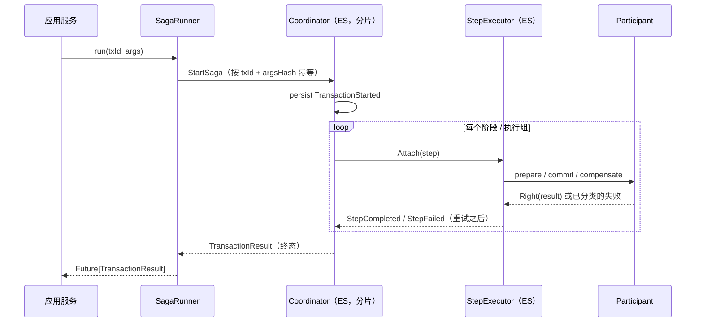

# Saga 指南 —— TCC Saga 引擎（`saga-core`）

[English](SAGA_GUIDE.md) | 中文

`net.imadz.infra.saga` 是构建在 Akka Typed 集群分片与事件溯源之上的 **TCC（Try-Confirm/Cancel）分布式事务引擎**。Saga 的每一份状态——整个事务、以及每个阶段的每个步骤——都是事件溯源 actor，因此进行中的 Saga 在节点崩溃后无需任何外部事务日志即可恢复。

其他文档：[README](../README-zh.md) · 遗留银行域指南：[DDD_GUIDE-zh.md](legacy/DDD_GUIDE-zh.md)（中文）/ [DDD_GUIDE.md](legacy/DDD_GUIDE.md)（EN）

---

## 目录

1. [为什么选择 TCC](#1-为什么选择-tcc)
2. [架构](#2-架构)
3. [转账是如何工作的](#3-转账是如何工作的)
4. [代码上手（四步）](#4-代码上手四步)
5. [核心概念](#5-核心概念)
6. [事务生命周期](#6-事务生命周期)
7. [人工干预](#7-人工干预)
8. [持久化与序列化](#8-持久化与序列化)
9. [验收标准](#9-验收标准)
10. [Showcase 演练脚本](#10-showcase-演练脚本)
11. [已知限制](#11-已知限制)

---

## 1. 为什么选择 TCC

一笔转账必须触碰两个聚合（A 扣款、B 入账）。跨两个分片事件溯源实体的 ACID 事务既不可行也不可取。TCC 用业务层的"预留"替代 2PC 锁：

| 阶段 | 这里的含义（付款方 `transfer-out` / 收款方 `transfer-in`） |
|---|---|
| **Try**（prepare） | 在 A 预留资金 / 在 B 登记入账——业务层面"占住"这笔钱 |
| **Confirm**（commit） | 扣减 A 的预留 / 把入账提交进 B 的余额 |
| **Cancel**（compensate） | 释放 A 的预留 / 取消 B 的入账 |

由于 *Try* 在设计上可逆，任何环节 *Confirm* 失败都可以通过补偿"所有已 Try 的步骤"自愈——**反向补偿**——全程不持有跨服务锁。

## 2. 架构

每个事务涉及三种事件溯源 actor 角色：

| 角色 | 数量 | 持久化 ID | 职责 |
|---|---|---|---|
| `SagaTransactionCoordinator` | 每事务 1 个 | `saga-coordinator-<txId>` | 持有整个事务状态机；驱动阶段/执行组；持久化生命周期事件 |
| `StepExecutor` | 每个（步骤，阶段）1 个 | `saga-executor-<txId>-<stepId>-<phase>` | 精确执行一个步骤×阶段，带重试/超时/熔断；持久化自身结果 |
| 参与者 | 无（普通对象） | 永不持久化 | 你的业务适配器；恢复时从注册的 `SagaDefinition` 重建 |



值得了解的设计要点：

- **参与者永不入 journal**（saga_v3 原则）：journal 只记录 `(定义名, 版本, 参数, argsHash, 步骤描述符)`。恢复时协调器从 `SagaRegistry` 重新物化活的步骤对象——这也是定义漂移检测的实现方式（结构不匹配 ⇒ 挂起，绝不猜测）。
- **Attach 是 `StepExecutor` 唯一的再驱动入口**（恢复后也一样）；终态回复会被缓存，已完成的步骤被再次 Attach 时重放缓存结论而不是重复执行副作用。
- **世代号防护**：每个在途操作携带尝试序号，被新尝试取代的迟到响应会被丢弃，关闭"迟到响应导致双重副作用"的窗口。

## 3. 转账是如何工作的

银行应用这样把引擎接到 DDD 聚合上：

| 步骤 | 参与者 | prepare（Try） | commit（Confirm） | compensate（Cancel） | 错误分类 |
|---|---|---|---|---|---|
| `transfer-out` | `FromAccountParticipant` | `ReserveFunds` | `DeductFunds` | `ReleaseReservedFunds` | 60003/60004 → 不可重试 |
| `transfer-in` | `ToAccountParticipant` | `RecordIncomingCredits` | `CommitIncomingCredits` | `CancelIncomingCredit` | 60003/60004 → 不可重试 |

两个步骤都在 `stepGroup = 1`（并行执行）。`preCheck` 在启动前拒绝非正金额（40001）和自我转账（40002）。完成后 `onResult` 产出 `MoneyTransferCompleted` 业务事件，由 `SagaBusinessEventProjection` 解析并发布。

## 4. 代码上手（四步）

运行你自己的 Saga 只需四步（全文另见 [`saga-core/README.md`](../saga-core/README.md)）：

**1. 定义参与者** —— 继承 `AskParticipant`，绑定你关心的阶段：

```scala
class MyParticipant(id: String)(implicit ec, scheduler)
    extends AskParticipant[String, String, MyCtx](rules = ErrorRules.none, askTimeout = 5.seconds) {

  override val prepareBinding = Some(PhaseAsk.direct((txId, ctx, _) => ctx.repo.reserve(txId)))
  override val commitBinding  = Some(PhaseAsk.direct((txId, ctx, _) => ctx.repo.deduct(txId)))
  override val compensateBinding = Some(PhaseAsk.direct((txId, ctx, _) => ctx.repo.release(txId)))
}
```

**2. 定义事务** —— 声明式、类型安全、可重放：

```scala
val definition = SagaDefinition[String, MyCtx, MyArgs](
  name = "my-saga", version = 1,
  argsCodec = ArgsCodec.playJson[MyArgs],
  steps = args => Seq(
    SagaStep("step-1", new MyParticipant("s1"), ResiliencePolicy(maxRetries = 3), stepGroup = 1),
    SagaStep("step-2", new MyParticipant("s2"), stepGroup = 2)),   // 组 2 在组 1 之后
  preCheck = args => if (args.valid) Right(args) else Left("40001"),
  onResult = (args, result) => Seq(MySagaCompleted(args.key))
)
SagaRegistry.register(definition)
```

**3. 一次性引导** —— 实现 `SagaEngineBootstrap` trait，创建共享的协调器分片（应用中由 `ApplicationBootstrap` 完成）：

```scala
object MyBootstrap extends SagaEngineBootstrap
MyBootstrap.initSagaEngine(sharding, context = myCtx, system)   // 协调器实体 + 步骤执行器工厂
```

**4. 启动事务** —— runner 按 `txId` 幂等，提供完成 Future + 持久化轮询 + 运维操作：

```scala
val runner = new SagaRunner(definition, txId => SagaEngineBootstrap.coordinatorRef(sharding, txId), system)

runner.run("my-tx-id", args, traceId)                 // Future[TransactionResult]
runner.statusOf("my-tx-id")                           // Future[Option[StatusSnapshot]]
runner.admin.fixStep("my-tx-id", "step-1", SagaPhase.CompensatePhase)
runner.admin.resolveSuspended("my-tx-id")
```

## 5. 核心概念

| 概念 | 位置 | 说明 |
|---|---|---|
| **阶段** —— prepare → commit → compensate | `SagaPhase` | 每步骤的 TCC 映射；步骤可以只绑定部分阶段（`PhaseAwareParticipant.boundPhases`） |
| **执行组** —— `SagaStep(stepGroup = n)` | 定义 | 同一阶段内各组顺序执行；组内步骤并行。补偿按组逆序回滚。 |
| **弹性策略** —— `ResiliencePolicy(maxRetries, timeoutPerAttempt, recovery, circuitBreaker)` | 每步骤 + 定义默认值 | 指数退避重试（初始 100ms）、每次尝试的 ask 超时、步骤级熔断 |
| **双轨错误分类** —— `ErrorRules[E]` | 参与者 | 业务错误（`Left(E)`）与抛出的异常分别分类为 `RetryableFailure` / `NonRetryableFailure`；可重试 ⇒ 执行器保持 `Ongoing` 并重试；不可重试 ⇒ `Failed`，协调器转入补偿或挂起 |
| **幂等** —— `txId` + `argsHash`（SHA-256） | `StartSaga` | 同 txId + 同参数 ⇒ `AlreadyRunning`/`AlreadyFinished`；同 txId + 异参数 ⇒ `ConflictingArgs` 拒绝 |
| **定义漂移防护** | `validateStructure` | 同名同版本下步骤计划发生变化时挂起事务，绝不带着不匹配的定义重放 |
| **挂起** | `TransactionSuspended` | 物化失败、全局超时、或补偿阶段不可重试失败时，事务带原因挂起——可由运维恢复（§7） |
| **进度事件** | `SagaProgressEvent`（7 种） | 发布到事件流；Showcase UI 经 WebSocket 实时展示 |

## 6. 事务生命周期

```
Created ──StartSaga──▶ InProgress ──全部阶段完成──▶ Completed
                          │  │
            prepare 失败  │  │ compensate 阶段不可重试失败
                          ▼  ▼
                    Compensating ──补偿完成──▶ Failed（"transaction failed but compensated"）
                          │
                          └─ 无法推进 ─▶ Suspended ──人工修复 + resume──▶ Failed / Completed
```

终态是真实的：协调器持久化 `TransactionCompleted`/`TransactionFailed` 后停止；之后的 `StartSaga` 或状态查询通过重放 journal 复活它。

## 7. 人工干预

运维操作经 `SagaRunner.admin` 暴露（HTTP 封装在 `ShowcaseController`）：

| 操作 | 命令 | 效果 |
|---|---|---|
| `proceed` | `ProceedNext` | 让暂停（单步调试）的事务前进一组 |
| `fixStep` | `ManualFixStep` | **持久化** `StepManuallyFixed(stepId, phase)`——操作员声明该步骤已在系统外修复 |
| `resume` | `ResolveSuspended` | 重新驱动当前阶段；已手动修复的步骤会被**跳过**（这是 journal 事实，不受执行器消息投递竞态影响）；事务随后跑到终态 |
| `retryPhase` | `RetryCurrentPhase` | 持久化 `TransactionRetried` 并重试当前阶段 |

manual-fix 记录保存在*协调器自己的 journal*——它是权威数据源——因此跨重启、跨节点的恢复是确定性的。（对**非挂起**事务调用 `fixStep` 仍走 legacy 的 best-effort 执行器通知路径。）

## 8. 持久化与序列化

- journal 格式：`saga_v3.proto`（`saga-core/src/main/protobuf/`）—— `SagaTransactionCoordinatorEventPO`、`StepExecutorEventPO`、`StepDescriptorPO`、`StepOutcomePO` 等，由 `SagaTransactionCoordinatorEventAdapter` / `StepExecutorEventAdapter` 映射。
- journal 只记录静态描述符与生命周期事实（包括逐步骤 `StepOutcome` 与 `StepManuallyFixed`），不记录参与者，除编码参数外不记录业务数据。
- 协调器 journal 还供读侧投影（`SagaBusinessEventProjection`）消费，事后解析 `onResult` 业务事件。
- 集群消息走 jackson-cbor（`CborSerializable`）；绑定由验收标准 AC-1.9 断言。

## 9. 验收标准

实现在 `saga-core/src/test`（`sbt sagaCore/test`，53 个用例，内存 journal）：

| AC | 验收标准 | 所在 Spec |
|---|---|---|
| AC-1.1 | 定义展开（步骤 × 阶段 × 组） | `SagaDslAcceptanceSpec` |
| AC-1.2 | 双轨错误分类 | `SagaDslAcceptanceSpec` |
| AC-1.3 | 幂等启动矩阵（7 分支） | `SagaDslAcceptanceSpec` |
| AC-1.4 | 崩溃恢复（journal 重放，含 PO 断言） | `SagaDslAcceptanceSpec` |
| AC-1.5 | `Attach` 语义（Created / Ongoing / 终态） | `StepExecutorAcceptanceSpec` |
| AC-1.6 | 世代号防护——迟到响应丢弃 | `StepExecutorAcceptanceSpec` |
| AC-1.7 | 重入安全 | `SagaDslAcceptanceSpec` |
| AC-1.8 | 定义漂移处理 | `SagaDslAcceptanceSpec` |
| AC-1.9 | 序列化绑定（禁用 Java 序列化器） | `SerializationBindingAcceptanceSpec` |
| AC-1.10 | journal 内容 | `SagaDslAcceptanceSpec` |
| AC-1.11 | 弹性策略激活（重试 / 超时） | `SagaDslAcceptanceSpec`、`StepExecutorAcceptanceSpec` |
| AC-1.12 | Runner 完成桥、statusOf、启动拒绝 | `SagaRunnerAcceptanceSpec` |
| AC-MF | 人工修复恢复（持久化修复、重启安全、到达终态） | `ManualFixRecoveryAcceptanceSpec` |

## 10. Showcase 演练脚本

启动应用（`sbt run`，端口 9806）后用 curl 驱动；同样的流程也可以在 `http://127.0.0.1:9806/showcase` 页面上操作：

```bash
B=http://127.0.0.1:9806

# 1. 正常路径——组顺序执行，事务 Completed
curl -X POST "$B/api/saga/trigger-showcase/false"
# 轮询：curl $B/api/saga/status/<transactionId>

# 2. 自愈重试——失败两次后成功
curl -X POST "$B/api/saga/inject-fault/Step-B/failtwicethensucceed"
curl -X POST "$B/api/saga/trigger-showcase/false"
# 历史中可见 RetryableFailure ×2 + Retry #1/#2，随后 StepCompleted，状态 Completed

# 3. 反向补偿——prepare 阶段不可重试失败
curl -X POST "$B/api/saga/inject-fault/Step-B/failnonretryable"
curl -X POST "$B/api/saga/trigger-showcase/false"
# 状态：Compensating → Failed；已 prepare 的步骤被补偿

# 4. 挂起 + 人工修复——补偿本身也失败
curl -X POST "$B/api/saga/inject-fault/Step-C/failnonretryable"
curl -X POST "$B/api/saga/trigger-showcase/false"          # 等待状态变为 "Suspended"
curl -X POST "$B/api/saga/inject-fault/Step-C/success"      # 操作员修复根因
curl -X POST "$B/api/saga/fix-step/<txId>/Step-C/compensate"
curl -X POST "$B/api/saga/resume/<txId>"
# => {"transactionStatus":"Failed","failReason":"transaction failed but compensated"}

# 演示后务必复位脚本
curl -X POST "$B/api/saga/inject-fault/Step-B/success"
curl -X POST "$B/api/saga/inject-fault/Step-C/success"
```

路径 5（单步调试）在页面上操作最直观：以 `singleStep=true` 触发，观察事务在每组前暂停，点击 **Proceed** 推进。

## 11. 已知限制

- 对已处于终态 `Failed` 的执行器执行 `retry-phase` 会重放缓存的失败而不是重新执行；受支持的恢复路径是 `fix-step` + `resume`。可靠的执行器 Reset 机制是计划中的改进。
- `conf/serialization.conf` 开启了 `allow-java-serialization = on`（`saga-core` 的 `reference.conf` 中记录的技术债）；无论如何，AC-1.9 保证所有线上消息走 cbor/protobuf。
- 历史重试在事件历史中可见，但状态快照中的 `retries` 计数只在执行器仍存活时是实时的。
