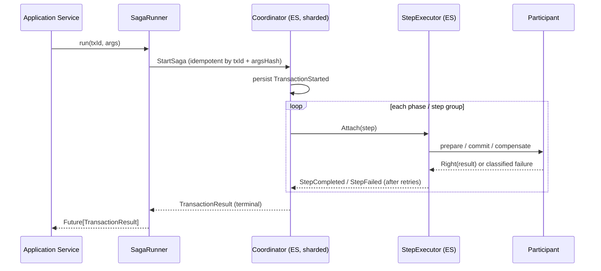

# Saga Guide — The TCC Saga Engine (`saga-core`)

English | [中文](SAGA_GUIDE-zh.md)

`net.imadz.infra.saga` is a **TCC (Try-Confirm/Cancel) distributed-transaction engine** built on Akka Typed Cluster Sharding and Event Sourcing. Every piece of saga state — the transaction, and each step of each phase — is an event-sourced actor, so in-flight sagas survive node crashes without any external transaction log.

Other guides: [README](../README.md) · [ChainDsl Guide](CHAINDSL_GUIDE.md) (EN) / [ChainDsl 指南](CHAINDSL_GUIDE-zh.md) (中文) · Legacy banking-domain guide: [DDD_GUIDE.md](legacy/DDD_GUIDE.md) (EN) / [DDD_GUIDE-zh.md](legacy/DDD_GUIDE-zh.md) (中文)

---

## Table of Contents

1. [Why TCC](#1-why-tcc)
2. [Architecture](#2-architecture)
3. [How a Transfer Works](#3-how-a-transfer-works)
4. [Quick Start in Code](#4-quick-start-in-code)
5. [Core Concepts](#5-core-concepts)
6. [Transaction Lifecycle](#6-transaction-lifecycle)
7. [Manual Intervention](#7-manual-intervention)
8. [Persistence & Serialization](#8-persistence--serialization)
9. [Acceptance Criteria](#9-acceptance-criteria)
10. [Showcase Walkthrough](#10-showcase-walkthrough)
11. [Known Limitations](#11-known-limitations)

---

## 1. Why TCC

A money transfer must touch two aggregates (debit A, credit B). ACID transactions across two sharded event-sourced entities are neither possible nor desirable. TCC replaces the 2PC lock with business-level reservations:

| Phase | Meaning here (payer `transfer-out` / payee `transfer-in`) |
|---|---|
| **Try** (prepare) | Reserve funds on A / register incoming credit on B — the business "holds" the money |
| **Confirm** (commit) | Deduct the reservation on A / commit the credit into B's balance |
| **Cancel** (compensate) | Release the reservation on A / cancel the credit on B |

Because *Try* is reversible by design, a failed *Confirm* anywhere can be healed by compensating everything already tried — **reverse compensation** — with no locks held across services.

## 2. Architecture

Three event-sourced actor roles per transaction:

| Role | Cardinality | Persistence ID | Responsibility |
|---|---|---|---|
| `SagaTransactionCoordinator` | 1 per transaction | `saga-coordinator-<txId>` | Owns the whole transaction state machine; drives phases/groups; journals lifecycle events |
| `StepExecutor` | 1 per (step, phase) | `saga-executor-<txId>-<stepId>-<phase>` | Executes exactly one step×phase with retries/timeout/circuit breaker; journals its own outcome |
| Participant | n/a (plain object) | never persisted | Your business adapter; rebuilt from the registered `SagaDefinition` at recovery time |



Design points worth knowing:

- **Participants never enter the journal** (the saga_v3 principle): the journal records `(definition name, version, args, argsHash, step descriptors)`. On recovery the coordinator re-materializes live step objects from the `SagaRegistry` — this is also how definition drift is detected (structural mismatch ⇒ suspend, never guess).
- **Attach is the only re-drive entry** into a `StepExecutor` (also after recovery); terminal replies are cached, so a re-attached finished step replays its verdict instead of re-executing side effects.
- **Generation guards**: every in-flight operation carries an attempt number; stale responses from superseded attempts are dropped, closing the late-response double-side-effect window.

## 3. How a Transfer Works

The banking app wires the engine to the DDD aggregates like this:

| Step | Participant | prepare (Try) | commit (Confirm) | compensate (Cancel) | Error classification |
|---|---|---|---|---|---|
| `transfer-out` | `FromAccountParticipant` | `ReserveFunds` | `DeductFunds` | `ReleaseReservedFunds` | 60003/60004 → non-retryable |
| `transfer-in` | `ToAccountParticipant` | `RecordIncomingCredits` | `CommitIncomingCredits` | `CancelIncomingCredit` | 60003/60004 → non-retryable |

Both steps sit in `stepGroup = 1` (they run in parallel). `preCheck` rejects non-positive amounts (40001) and self-transfers (40002) before anything starts. On completion, `onResult` emits a `MoneyTransferCompleted` business event which the `SagaBusinessEventProjection` resolves and publishes.

## 4. Quick Start in Code

Four steps to run your own saga (full text also in [`saga-core/README.md`](../saga-core/README.md)):

**1. Define a participant** — extend `AskParticipant` and bind the phases you care about:

```scala
class MyParticipant(id: String)(implicit ec, scheduler)
    extends AskParticipant[String, String, MyCtx](rules = ErrorRules.none, askTimeout = 5.seconds) {

  override val prepareBinding = Some(PhaseAsk.direct((txId, ctx, _) => ctx.repo.reserve(txId)))
  override val commitBinding  = Some(PhaseAsk.direct((txId, ctx, _) => ctx.repo.deduct(txId)))
  override val compensateBinding = Some(PhaseAsk.direct((txId, ctx, _) => ctx.repo.release(txId)))
}
```

**2. Define the transaction** — declarative, type-safe, replayable:

```scala
val definition = SagaDefinition[String, MyCtx, MyArgs](
  name = "my-saga", version = 1,
  argsCodec = ArgsCodec.playJson[MyArgs],
  steps = args => Seq(
    SagaStep("step-1", new MyParticipant("s1"), ResiliencePolicy(maxRetries = 3), stepGroup = 1),
    SagaStep("step-2", new MyParticipant("s2"), stepGroup = 2)),   // group 2 starts after group 1
  preCheck = args => if (args.valid) Right(args) else Left("40001"),
  onResult = (args, result) => Seq(MySagaCompleted(args.key))
)
SagaRegistry.register(definition)
```

**3. Bootstrap once** — a `SagaEngineBootstrap` implementation creates the shared coordinator sharding (the app does this in `ApplicationBootstrap`):

```scala
object MyBootstrap extends SagaEngineBootstrap
MyBootstrap.initSagaEngine(sharding, context = myCtx, system)   // coordinator entity + step-executor factory
```

**4. Run it** — the runner is idempotent per `txId` and gives you a completion future + durable polling + admin ops:

```scala
val runner = new SagaRunner(definition, txId => SagaEngineBootstrap.coordinatorRef(sharding, txId), system)

runner.run("my-tx-id", args, traceId)                 // Future[TransactionResult]
runner.statusOf("my-tx-id")                           // Future[Option[StatusSnapshot]]
runner.admin.fixStep("my-tx-id", "step-1", SagaPhase.CompensatePhase)
runner.admin.resolveSuspended("my-tx-id")
```

## 5. Core Concepts

| Concept | Where | Notes |
|---|---|---|
| **Phases** — prepare → commit → compensate | `SagaPhase` | TCC mapping per step; steps may bind only some phases (`PhaseAwareParticipant.boundPhases`) |
| **Execution groups** — `SagaStep(stepGroup = n)` | definition | Groups within a phase run sequentially; steps *inside* a group run in parallel. Compensation walks groups in reverse. |
| **Resilience policy** — `ResiliencePolicy(maxRetries, timeoutPerAttempt, recovery, circuitBreaker)` | per step + definition default | Retries with exponential backoff (100 ms initial), per-attempt ask timeout, circuit breaker per step |
| **Dual-track error classification** — `ErrorRules[E]` | participant | Business errors (`Left(E)`) and thrown exceptions are classified into `RetryableFailure` / `NonRetryableFailure`; retryable ⇒ executor stays `Ongoing` and retries, non-retryable ⇒ `Failed` and the coordinator compensates or suspends |
| **Idempotency** — `txId` + `argsHash` (SHA-256) | `StartSaga` | Same txId + same args ⇒ `AlreadyRunning`/`AlreadyFinished`; same txId + different args ⇒ `ConflictingArgs` rejection |
| **Definition drift protection** | `validateStructure` | A changed step plan under the same (name, version) suspends the transaction instead of replaying against a mismatched definition |
| **Suspension** | `TransactionSuspended` | Materialize failure, global timeout, or a non-retryable compensate failure parks the transaction with a reason — recoverable by ops (§7) |
| **Progress events** | `SagaProgressEvent` (7 kinds) | Published to the event stream; the Showcase UI streams them over WebSocket |

## 6. Transaction Lifecycle

```
Created ──StartSaga──▶ InProgress ──all phases done──▶ Completed
                          │  │
            prepare fails │  │ compensate fails (non-retryable)
                          ▼  ▼
                    Compensating ──compensated──▶ Failed ("transaction failed but compensated")
                          │
                          └─ cannot proceed ─▶ Suspended ──manual fix + resume──▶ Failed / Completed
```

Terminal states are real: the coordinator journals `TransactionCompleted`/`TransactionFailed` and stops; a later `StartSaga` or status query resurrects it by replaying the journal.

## 7. Manual Intervention

Admin ops ride `SagaRunner.admin` (HTTP wrappers in `ShowcaseController`):

| Op | Command | Effect |
|---|---|---|
| `proceed` | `ProceedNext` | Advance a paused (single-step) transaction by one group |
| `fixStep` | `ManualFixStep` | **Journal** `StepManuallyFixed(stepId, phase)` — the operator declares the step externally resolved |
| `resume` | `ResolveSuspended` | Re-drive the current phase; manually-fixed steps are **skipped** (journaled fact, immune to executor-delivery races); the transaction then runs to its terminal state |
| `retryPhase` | `RetryCurrentPhase` | Persist `TransactionRetried` and re-execute the current phase |

The manual-fix record lives in the *coordinator's own journal* — the authoritative source — so recovery is deterministic across restarts and node moves. (`fixStep` on a **non-suspended** transaction keeps the legacy best-effort executor notify path.)

## 8. Persistence & Serialization

- Journal format: `saga_v3.proto` (`saga-core/src/main/protobuf/`) — `SagaTransactionCoordinatorEventPO`, `StepExecutorEventPO`, `StepDescriptorPO`, `StepOutcomePO`, … mapped by `SagaTransactionCoordinatorEventAdapter` / `StepExecutorEventAdapter`.
- Journals record static descriptors + lifecycle facts (including per-step `StepOutcome`s and `StepManuallyFixed`), never participants, never business payloads beyond the encoded args.
- Coordinator journal also feeds a read-side projection (`SagaBusinessEventProjection`) that resolves `onResult` business events after the fact.
- Cluster messages are jackson-cbor (`CborSerializable`); bindings asserted by acceptance criterion AC-1.9.

## 9. Acceptance Criteria

Implemented in `saga-core/src/test` (`sbt sagaCore/test`, 53 cases, in-memory journal):

| AC | Criterion | Spec |
|---|---|---|
| AC-1.1 | Definition expansion (steps × phases × groups) | `SagaDslAcceptanceSpec` |
| AC-1.2 | Dual-track error classification | `SagaDslAcceptanceSpec` |
| AC-1.3 | Idempotent start matrix (7 branches) | `SagaDslAcceptanceSpec` |
| AC-1.4 | Crash recovery (journal replay incl. PO assertions) | `SagaDslAcceptanceSpec` |
| AC-1.5 | `Attach` semantics (Created / Ongoing / terminal) | `StepExecutorAcceptanceSpec` |
| AC-1.6 | Generation guard — stale responses dropped | `StepExecutorAcceptanceSpec` |
| AC-1.7 | Re-entrancy safety | `SagaDslAcceptanceSpec` |
| AC-1.8 | Definition drift handling | `SagaDslAcceptanceSpec` |
| AC-1.9 | Serialization bindings (no Java serializer) | `SerializationBindingAcceptanceSpec` |
| AC-1.10 | Journal contents | `SagaDslAcceptanceSpec` |
| AC-1.11 | Resilience activation (retries / timeout) | `SagaDslAcceptanceSpec`, `StepExecutorAcceptanceSpec` |
| AC-1.12 | Runner completion bridge, statusOf, start rejections | `SagaRunnerAcceptanceSpec` |
| AC-MF | Manual-fix recovery (journaled fix, restart-safe, terminal completion) | `ManualFixRecoveryAcceptanceSpec` |

## 10. Showcase Walkthrough

Start the app (`sbt run`, port 9806) and drive with curl; the same flows work from `http://127.0.0.1:9806/showcase`:

```bash
B=http://127.0.0.1:9806

# 1. Normal path — groups in order, transaction Completed
curl -X POST "$B/api/saga/trigger-showcase/false"
# poll: curl $B/api/saga/status/<transactionId>

# 2. Self-healing retry — fail twice, then succeed
curl -X POST "$B/api/saga/inject-fault/Step-B/failtwicethensucceed"
curl -X POST "$B/api/saga/trigger-showcase/false"
# history shows RetryableFailure ×2 + Retry #1/#2, then StepCompleted, status Completed

# 3. Reverse compensation — non-retryable prepare failure
curl -X POST "$B/api/saga/inject-fault/Step-B/failnonretryable"
curl -X POST "$B/api/saga/trigger-showcase/false"
# status: Compensating → Failed; already-prepared steps compensated

# 4. Suspension + manual fix — the compensate itself fails
curl -X POST "$B/api/saga/inject-fault/Step-C/failnonretryable"
curl -X POST "$B/api/saga/trigger-showcase/false"          # wait for status "Suspended"
curl -X POST "$B/api/saga/inject-fault/Step-C/success"      # operator fixes the root cause
curl -X POST "$B/api/saga/fix-step/<txId>/Step-C/compensate"
curl -X POST "$B/api/saga/resume/<txId>"
# => {"transactionStatus":"Failed","failReason":"transaction failed but compensated"}

# always reset the script afterwards
curl -X POST "$B/api/saga/inject-fault/Step-B/success"
curl -X POST "$B/api/saga/inject-fault/Step-C/success"
```

Path 5 (single-step debug) is easiest from the UI: trigger with `singleStep=true`, watch the transaction pause before each group, and click **Proceed**.

## 11. Known Limitations

- `retry-phase` against an executor already in a terminal `Failed` state replays the cached failure instead of re-executing; the supported recovery path is `fix-step` + `resume`. A reliable executor-reset mechanism is the planned improvement.
- `conf/serialization.conf` enables `allow-java-serialization = on` (documented technical debt in `saga-core`'s `reference.conf`); AC-1.9 keeps all wire messages on cbor/protobuf regardless.
- Historical retries are visible in the event history, but the `retries` counter in status snapshots is only live for steps whose executor is still running.
