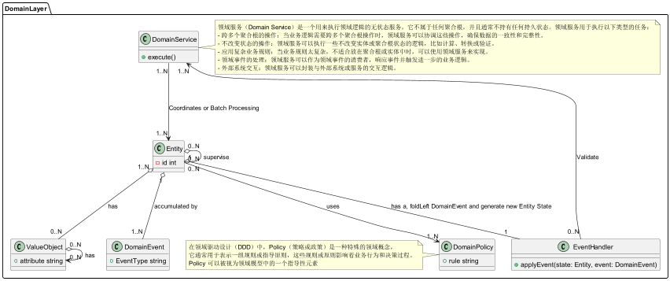
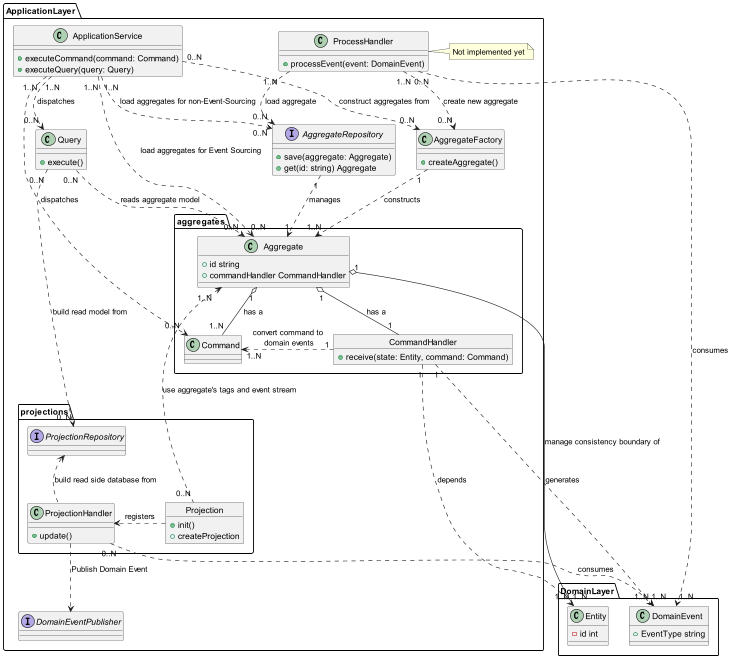
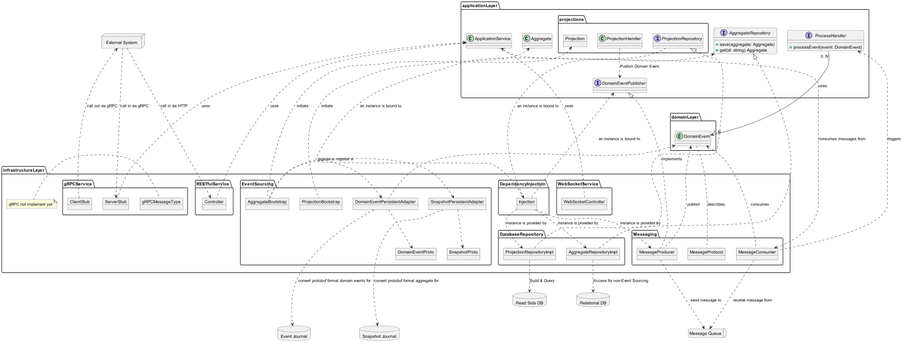

# Onion Architecture + DDD + CQRS/ES Reference

> 从 README v1 归档。本文档详细描述了项目的分层架构设计、DDD 组件及其关系、以及 Saga 分布式事务协调器的生命周期。
> 当前代码结构见项目根目录，本文档侧重概念与设计原理。

## Onion Architecture Principles

The Onion Architecture separates business complexity from technical complexity, and within business complexity, it further separates domain complexity from use case complexity:

- **Business Complexity**
  - **Domain Complexity → Domain Layer**: Enterprise business domain logic that is independent of specific business application scenarios.
  - **Use Case Complexity → Application Layer**: The specific scenario or product implementation of the enterprise business domain rules, and the logic for interaction with users or other businesses.
- **Technical Complexity → Infrastructure Layer**: External frameworks, persistence, messaging, and all side effects.

```
domain/          ← 纯领域层：Entity, ValueObject, DomainEvent, Invariant
application/     ← 用例层：Aggregate, ApplicationService, Saga, Projection
infrastructure/  ← 适配层：Persistence adapter, Bootstrap, DI binding
```

**Dependency Rule (Iron Law): Inner layers NEVER import outer layer packages.**

## Domain Layer Components



- **ValueObject**: Immutable objects without unique identifiers. Defined by property values, such as currency, dates, etc.

- **DomainEvent**: Represents significant events that occur in the domain, which can trigger other operations or state changes. Domain events are also very important glue in the microservice system architecture, used to disseminate business changes between systems, with far superior information volume compared to CDC at the database level.

- **Entity**: Objects with unique identifiers. The RootEntity is the core of the aggregate, representing the overall state of the aggregate.

- **InvariantRule**: Objects that define domain invariant guard rules, used to validate business rules and decide which events to produce.

- **EventHandler**: Components responsible for responding to and processing domain events.

- **DomainService**: Services that encapsulate domain logic that does not belong to entities or value objects.

### Relationships

- Entities and value objects are the basic building blocks of the domain model.
- Domain events are generated by entities or domain services and are processed by event handlers.
- Invariant rules are applied to entities and value objects to ensure the execution of business rules.
- Domain services coordinate the interaction between entities, value objects, and invariant rules.

## Application Layer Components



- **Aggregate**: Encapsulates the Root Entity. In Akka Event Sourcing, technical complexity is added, so it is separated into the Application Layer.

- **Command**: The operational protocol accepted by the aggregate.

- **CommandHandler**: Handles commands sent to the aggregate. Generally expressed as `(Command, State) => Effect[Event, State]`. In this framework's terminology, it corresponds to `(Command, RootEntity) => Effect[DomainEvent, RootEntity]`.

- **Projection**: Akka Projection factory, used to build CQRS materialized views.

- **ProjectionHandler**: Event handlers managed by Akka Projection. Accept domain events, complete ETL transformation, and store the new data model through the ProjectionRepository.

- **ProjectionRepository**: The repository interface for materialized views.

- **Query**: Used for business queries.

- **AggregateFactory**: A factory for building aggregates.

- **AggregateRepository**: A repository for obtaining or saving aggregates.

- **ApplicationService**: Completes user requests at the granularity of use cases or complex business tasks.

- **ProcessHandler**: Initiates or advances business processes based on business changes in the system.

- **DomainEventPublisher**: An interface for sending domain events to a message queue.

### Relationships

- Aggregates contain commands and command handlers.
- Command handlers convert commands into domain events.
- Projections register projection handlers.
- Projection handlers use projection repositories to build read-side databases.
- Application services distribute commands and queries.
- Queries read data from the aggregate model or projection repository.
- Aggregate repositories and factories manage and construct aggregates.
- Projections use aggregate tags and event streams.
- Projection handlers and process handlers consume domain events.
- Process handlers can load and create new aggregates.

## Infrastructure Layer Components



### Event Sourcing

- **DomainEventProto**: Protocol Buffers definition of domain events.
- **SnapshotProto**: Protocol Buffers definition of snapshots.
- **DomainEventPersistentAdapter**: Adapter for domain event persistence.
- **SnapshotPersistentAdapter**: Adapter for snapshot persistence.
- **AggregateBootstrap**: Aggregate bootstrap program.
- **ProjectionBootstrap**: Projection bootstrap program.

### Database Repository

- **AggregateRepositoryImpl**: Implementation of the aggregate repository.
- **ProjectionRepositoryImpl**: Implementation of the projection repository.

### RESTful & WebSocket Services

- **Controller**: REST API controller.
- **WebSocketController**: WebSocket controller.

### gRPC Services (planned)

- **ClientStub / ServerStub / gRPCMessageType**

### Messaging

- **MessageProducer / MessageConsumer / MessageProtocol**

### Dependency Injection

- **Injection**: Framework-specific DI bindings.

### Key Relationships

- AggregateRepositoryImpl and ProjectionRepositoryImpl implement the repository interfaces defined in the Application Layer.
- Controller, WebSocketController, and ServerStub use ApplicationService.
- MessageProducer implements the DomainEventPublisher interface.
- DomainEventPersistentAdapter and SnapshotPersistentAdapter interact with the Event Journal and Snapshot Journal.
- Dependency injection is responsible for binding and providing the implementation instances of various interfaces.

### External Interactions

- HTTP → Controller
- gRPC → ClientStub / ServerStub

### Data Storage

- Relational databases for non-event sourcing data storage.
- Read-side databases (MySQL) for query optimization.
- Event logs (MongoDB) and snapshot logs for event sourcing.

## Saga Distributed Transaction Lifecycle

The engine implements a **Backward Recovery** strategy to ensure eventual consistency across distributed participants.

### Transaction Phases

- **Prepare Phase**: The coordinator executes all participants' `doPrepare` logic in defined step groups.
- **Commit Phase**: Triggered only if **all** prepare steps succeed. Executes participants' `doCommit` logic.
- **Compensate Phase**: Triggered if **any** step fails in either the Prepare or Commit phases. Executes the `doCompensate` logic of participants.

### Failure Recovery Decision Matrix

| Failure Phase | Triggering Condition | Engine Action | Final State |
| :--- | :--- | :--- | :--- |
| **Prepare** | Logic Error / Timeout | **Compensate** | `FAILED` (Consistent Rollback) |
| **Commit** | Physical Failure / Timeout | **Compensate** | `FAILED` (Consistent Rollback) |
| **Compensate** | Any Error / Timeout | **Halt & Suspend** | `SUSPENDED` (Needs Manual Fix) |

### Key Design Principles

- **Selective Compensation**: Only participants that **successfully completed** their Prepare phase will be compensated. Steps that never started or failed during Prepare are skipped during rollback.
- **Result Atomicity (Map-based)**: Step results are tracked in a `Map`. A manual fix or successful retry will overwrite previous failures, allowing the state machine to advance correctly.
- **Suspended State**: If compensation fails, the transaction is "Hanging". Operators can use the **Manual Fix** capability via the UI/API to correct the participant state and then trigger **Retry Phase** to complete the rollback.
- **Persistence Guarantee**: Every state transition is backed by Akka Persistence (Event Sourcing). If the coordinator crashes or passivates, it recovers its exact progress, including the list of successfully prepared steps.

## DDD + Akka Event Sourcing Concept Mapping

These concepts together form a system architecture based on DDD and Akka Event Sourcing, implementing Command Query Responsibility Segregation (CQRS) and Event Sourcing patterns.

| DDD Concept | Akka / CQRS Mapping |
|---|---|
| Aggregate Root | EventSourcedBehavior |
| Domain Event | Persistence Event (Protobuf serialized) |
| Command | Actor Command message |
| Repository | ClusterSharding + EntityRef |
| Projection | Akka Projection (JDBC → MySQL read-side) |
| Saga | Event-sourced coordinator + per-step executor |
