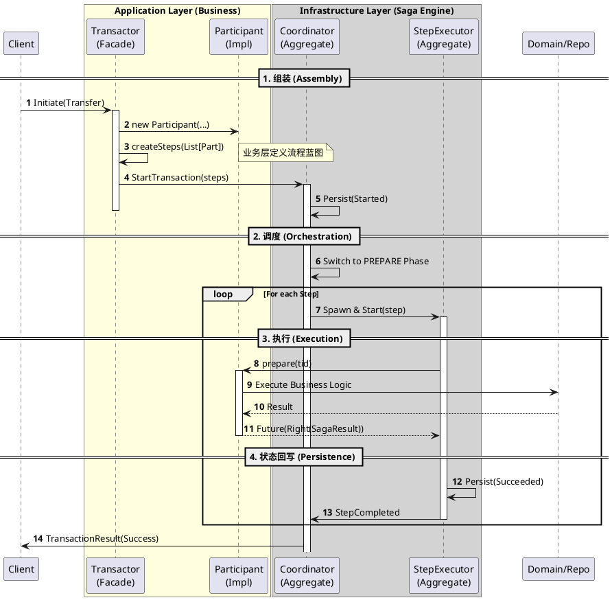

# Saga 分布式事务架构指南 (Saga Architecture Guide)

## 1. 核心设计原则 (Core Principles)

本系统采用 **编排式 Saga (Orchestration-based Saga)** 模式。核心设计哲学是 **“引擎与业务分离”**：
* **通用引擎 (Generic Engine)**：负责状态机流转、持久化、故障恢复、重试控制（Retry）、超时熔断（Circuit Breaker）。**严禁修改此层代码。**
* **业务扩展 (Business Extension)**：负责定义具体的业务流程（Plan）和每个步骤的具体执行逻辑（Action）。

---

## 2. 架构组件分层 (Component Layers)

### A. 基础设施层：通用引擎 (The Engine)
*位置：`net.imadz.infra.saga.*`*

1.  **`SagaTransactionCoordinator` (大管家)**:
    * **角色**: 聚合根 (Aggregate Root)。
    * **职责**: 维护整个事务的生命周期 (Prepare -> Commit/Compensate)。它只认识 `List[SagaTransactionStep]`，完全不关心具体业务。
2.  **`StepExecutor` (工头)**:
    * **角色**: 聚合根 (Aggregate Root)。
    * **职责**: 执行单个步骤。负责调用 Participant，并处理重试、超时和断路器逻辑。
3.  **`SagaParticipant[E, R]` (契约)**:
    * **角色**: 标准接口 (Trait)。
    * **职责**: 定义了业务必须实现的三个动作：`doPrepare`, `doCommit`, `doCompensate`。

### B. 应用层：业务扩展 (The Business)
*位置：`net.imadz.application.services.transactor`*

1.  **`{SagaName}Transactor` (门面/绘图师)**:
    * **类型**: **Artifact: Saga Transactor Shell**
    * **职责**: 定义事务的 Command/Reply 协议。包含 `createSteps(...)` 方法，负责实例化 Participants 并将它们编排成一个列表。
2.  **`{SagaName}TransactorBehaviors` (逻辑)**:
    * **类型**: **Artifact: Saga Transactor Behaviors**
    * **职责**: 一个无状态的 Actor 逻辑。它接收客户端请求，调用 `createSteps` 构建蓝图，然后向 `Coordinator` 发送 `StartTransaction` 指令。
3.  **`{Name}Participant` (搬砖工)**:
    * **类型**: **Artifact: Saga Participant**
    * **职责**: 实现 `SagaParticipant` 接口。在 `doPrepare/Commit` 中调用具体的聚合根 (Aggregate) 或 领域服务。
    * **关键**: 必须实现 `customClassification`，将领域错误明确分类为 `Retryable` (可重试) 或 `NonRetryable` (致命错误)。
4.  **`{SagaName}TransactionRepository` (接口)**:
    * **类型**: **Artifact: Saga Transaction Repository Trait**
    * **职责**: 定义获取 Transactor Actor 引用 (`ActorRef`) 的接口。

### C. 基础设施层：业务胶水 (The Glue)
*位置：`net.imadz.infrastructure.*`*

这些组件是连接“通用引擎”与“具体业务”的桥梁，**每个 Saga 业务都必须生成一套专属的实现**。

1.  **`{SagaName}CoordinatorBootstrap` (启动器)**:
    * **类型**: **Artifact: Saga Bootstrap**
    * **职责**: 初始化该业务专属的 `ClusterSharding` 分片。注入专属的 Serializer。
2.  **`{SagaName}StepSerializer` (多路复用器)**:
    * **类型**: **Artifact: Saga Serializer**
    * **职责**: **Payload Multiplexing**。将具体的业务 Proto 对象（如 `FromAccountPO`）序列化为字节，包装进通用的 `SagaParticipantPO` 中。这是解耦的关键。
3.  **`{SagaName}TransactionRepositoryImpl` (实现)**:
    * **类型**: **Artifact: Saga Repository Impl**
    * **职责**: 实现应用层的 Repo 接口，通过 Sharding 获取 Actor 引用。
4.  **`{saga_name}_transaction.proto` & `{saga_name}_participant.proto`**:
    * **类型**: **Artifact: Saga Protos**
    * **职责**: 定义业务专属的 Protobuf 消息。

---

## 3. 物理交付物映射表 (Artifact Mapping)

| 逻辑组件 | 物理文件模式 (Artifact Pattern) | 层级 |
| :--- | :--- | :--- |
| **Facade Shell** | `application/services/transactor/${SagaName}Transactor.scala` | App |
| **Facade Logic** | `application/services/transactor/${SagaName}TransactorBehaviors.scala` | App |
| **Participant** | `application/services/transactor/${ParticipantName}.scala` | App |
| **Repo Interface**| `application/services/transactor/${SagaName}TransactionRepository.scala` | App |
| **Repo Impl** | `infrastructure/repositories/service/${SagaName}TransactionRepositoryImpl.scala` | Infra |
| **Bootstrap** | `infrastructure/bootstrap/${SagaName}CoordinatorBootstrap.scala` | Infra |
| **Serializer** | `infrastructure/persistence/${SagaName}StepSerializer.scala` | Infra |
| **Proto (Tx)** | `protobuf/${saga_name}_transaction.proto` | Infra |
| **Proto (Part)**| `protobuf/${saga_name}_participant.proto` | Infra |

---

## 4. 核心交互流程 (Interaction Flow)



### 5.2 业务引导程序 (Bootstrap)

**注意：这里必须使用业务专属的 Serializer。**

```scala
class MoneyTransferSagaCoordinatorBootstrap {
  def init(...) = {
    // 注入业务专属的 Serializer
    val serializer = new MoneyTransferSagaStepSerializer(...)
    
    // 初始化 Coordinator，传入这个 serializer 用于解析步骤
    // Engine 会使用它将 ByteString 还原为 Participant 对象
    sharding.init(Entity(SagaTransactionCoordinator.TypeKey) { ctx =>
       SagaTransactionCoordinator(..., serializer)
    })
  }
}
```

