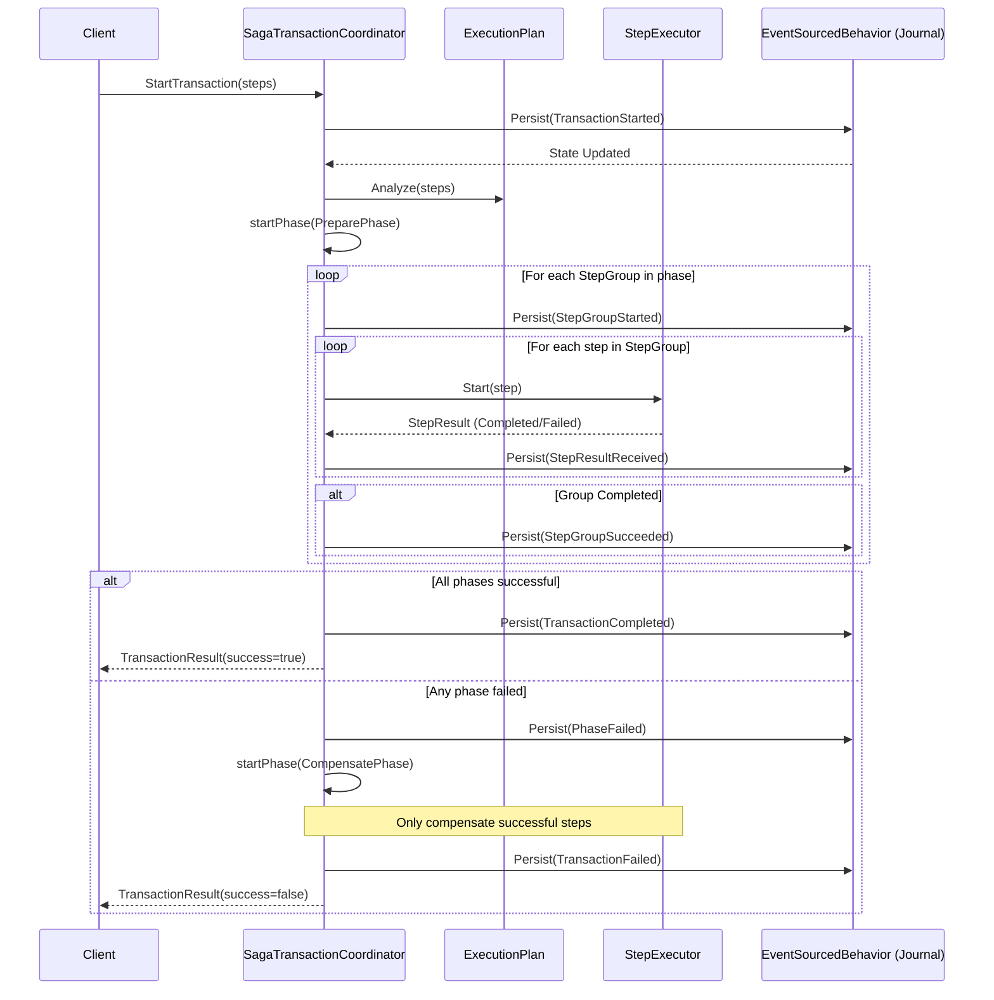
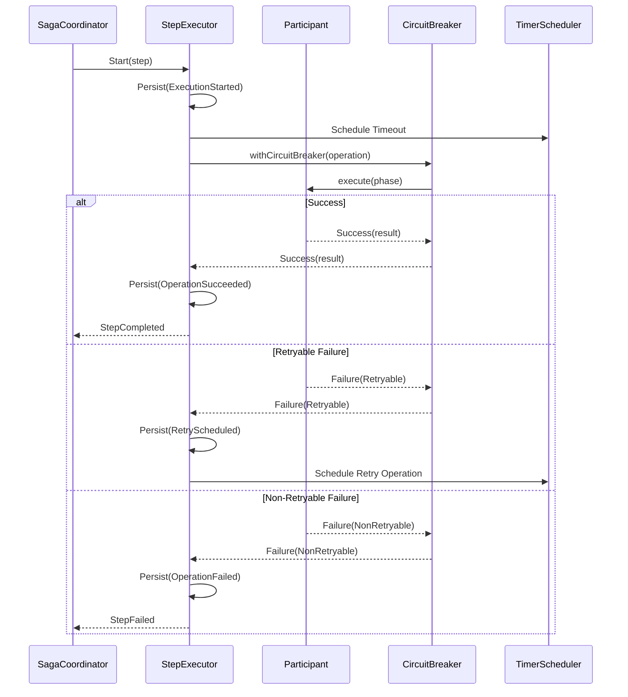

# Saga Framework Architecture & Components

The Saga engine is composed of three primary components working in orchestration: the **Coordinator**, the **Execution Plan**, and the **Step Executor**.

## 1. SagaTransactionCoordinator

The `SagaTransactionCoordinator` is an Akka Typed `EventSourcedBehavior` that acts as the stateful orchestrator for a single Saga transaction. It is typically accessed via Akka Cluster Sharding.

### Key Responsibilities:
- **State Management**: Persists critical transitions like `TransactionStarted`, `PhaseSucceeded`, and `StepResultReceived`.
- **Phase Control**: Manages the transitions between `Prepare`, `Commit`, and `Compensate` phases.
- **Error Handling**: Determines if a phase failure requires compensation or manual intervention (`Suspended` state).
- **Concurrency**: Manages parallel execution of steps within a `StepGroup`.

### Sequence Diagram: Coordinator Orchestration



## 2. ExecutionPlan & StepGroup

The `ExecutionPlan` is a utility class that organizes `SagaTransactionStep`s. It supports **parallel execution** within a phase by grouping steps.

- **StepGroup**: A set of steps that can be executed concurrently. The Coordinator only moves to the next group once all steps in the current group have completed successfully.
- **Phase Ordering**: The plan ensures that `Prepare` steps are executed before `Commit` steps, and `Compensate` steps are executed in reverse order if necessary.

## 3. StepExecutor

The `StepExecutor` is a short-lived Akka actor responsible for executing a single step of a Saga phase for a specific participant.

### Resilience Features:
- **Retries**: Automatically retries operations that return a `RetryableFailure` (e.g., timeouts, network glitches).
- **Timeouts**: Enforces a per-step timeout duration.
- **Circuit Breaker**: Integrates Akka's `CircuitBreaker` to prevent overwhelming a failing participant service.
- **Event Sourcing**: Like the Coordinator, the `StepExecutor` is event-sourced, allowing it to recover and resume a retry even after a crash.

### Sequence Diagram: Step Execution Lifecycle



## 4. SagaParticipant Interface

Developers implement the `SagaParticipant` trait to integrate their domain logic into the Saga framework.

```scala
trait SagaParticipant[E, R, C] {
  protected def doPrepare(transactionId: String, context: C, traceId: String): ParticipantEffect[E, R]
  protected def doCommit(transactionId: String, context: C, traceId: String): ParticipantEffect[E, R]
  protected def doCompensate(transactionId: String, context: C, traceId: String): ParticipantEffect[E, R]
  
  // Custom error classification logic
  protected def customClassification: PartialFunction[Throwable, RetryableOrNotException]
}
```

- **Context (`C`)**: A read-only context object (e.g., `MoneyTransferContext`) providing access to repositories, configuration, and other dependencies.
- **Effect**: The return type is a `Future[Either[E, SagaResult[R]]]`, where `E` is the domain error type and `R` is the successful result type.
