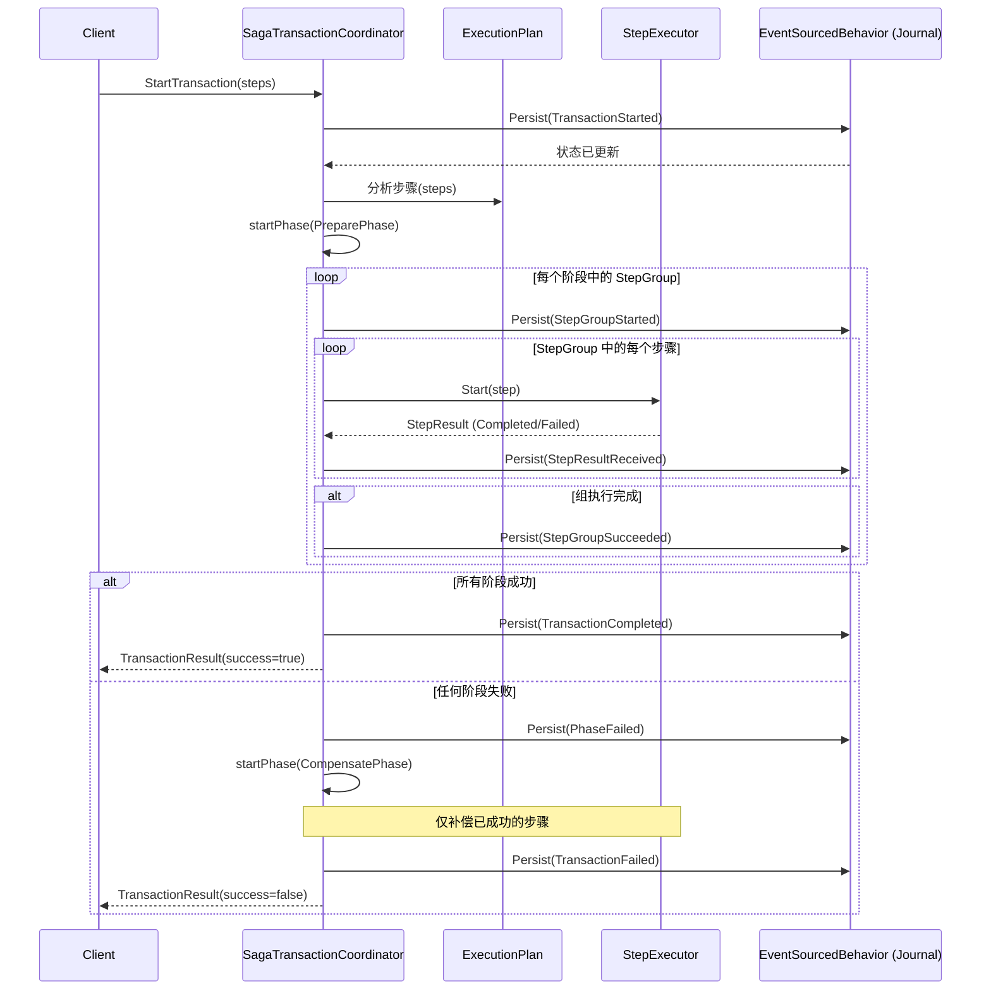
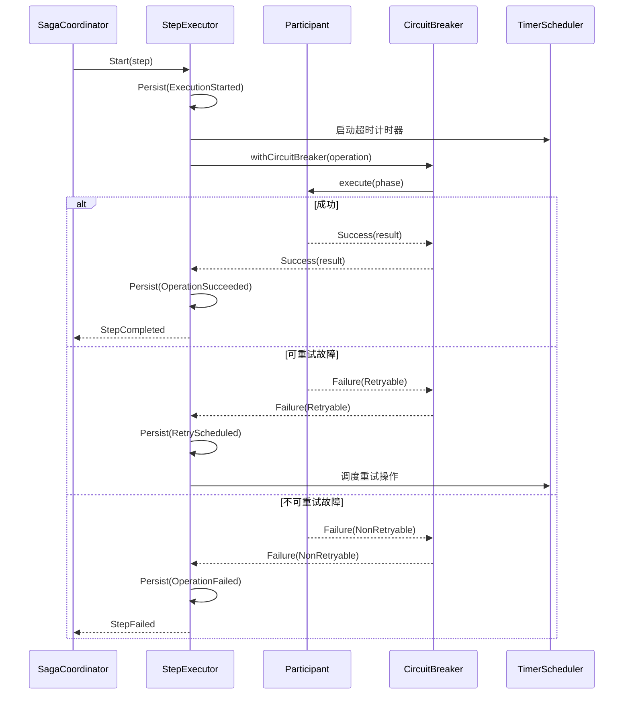

# Saga 框架架构与组件

Saga 引擎由三个主要组件协作而成：**协调器 (Coordinator)**、**执行计划 (Execution Plan)** 和 **步骤执行器 (Step Executor)**。

## 1. SagaTransactionCoordinator (事务协调器)

`SagaTransactionCoordinator` 是一个 Akka Typed `EventSourcedBehavior`，作为单个 Saga 事务的有状态编排器。通常通过 Akka Cluster Sharding 进行访问。

### 核心职责：
- **状态管理**：持久化关键转换，如 `TransactionStarted`、`PhaseSucceeded` 和 `StepResultReceived`。
- **阶段控制**：管理 `Prepare`、`Commit` 和 `Compensate` 阶段之间的转换。
- **错误处理**：决定阶段失败是否需要补偿或人工干预（`Suspended` 状态）。
- **并发管理**：管理 `StepGroup` 内步骤的并行执行。

### 时序图：协调器编排过程



## 2. ExecutionPlan 与 StepGroup (执行计划与步骤组)

`ExecutionPlan` 是一个工具类，用于组织 `SagaTransactionStep`。它通过将步骤分组来支持阶段内的 **并行执行**。

- **StepGroup (步骤组)**：一组可以并发执行的步骤。只有在当前组的所有步骤都成功完成后，协调器才会移动到下一组。
- **阶段顺序**：执行计划确保 `Prepare` 步骤在 `Commit` 步骤之前执行，并且在必要时以相反顺序执行 `Compensate` 步骤。

## 3. StepExecutor (步骤执行器)

`StepExecutor` 是一个短寿命的 Akka Actor，负责为特定的参与者执行 Saga 阶段中的单个步骤。

### 弹性特性：
- **重试 (Retries)**：自动重试返回 `RetryableFailure` 的操作（如超时、网络波动）。
- **超时 (Timeouts)**：强制执行每个步骤的超时时间。
- **熔断器 (Circuit Breaker)**：集成 Akka 的 `CircuitBreaker`，防止压垮持续故障的参与者服务。
- **事件溯源**：与协调器一样，`StepExecutor` 也是事件溯源的，允许它在崩溃后恢复并恢复重试。

### 时序图：步骤执行生命周期



## 4. SagaParticipant 接口

开发人员通过实现 `SagaParticipant` 特性来将他们的领域逻辑集成到 Saga 框架中。

```scala
trait SagaParticipant[E, R, C] {
  protected def doPrepare(transactionId: String, context: C, traceId: String): ParticipantEffect[E, R]
  protected def doCommit(transactionId: String, context: C, traceId: String): ParticipantEffect[E, R]
  protected def doCompensate(transactionId: String, context: C, traceId: String): ParticipantEffect[E, R]
  
  // 自定义错误分类逻辑
  protected def customClassification: PartialFunction[Throwable, RetryableOrNotException]
}
```

- **上下文 (`C`)**：一个只读的上下文对象（例如 `MoneyTransferContext`），提供对存储库、配置和其他依赖项的访问。
- **Effect (效果)**：返回类型是 `Future[Either[E, SagaResult[R]]]`，其中 `E` 是领域错误类型，`R` 是成功的结果类型。
