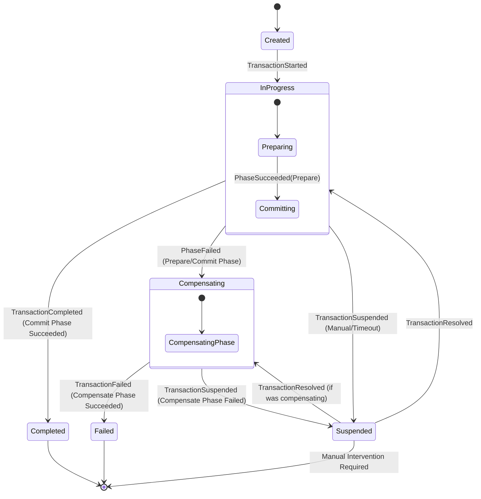

# Saga Framework Overview & Design Principles

## Introduction

In a microservices architecture or a distributed system based on isolated aggregates (like our Akka CQRS setup), maintaining consistency across multiple services is a challenge. Traditional Two-Phase Commit (2PC) is often too heavy and doesn't scale well in high-availability environments.

Our **Saga Framework** provides a robust solution for managing **distributed transactions** using the **Saga Pattern**, specifically implemented with the **TCC (Try-Confirm-Cancel)** model.

## Design Goals (ACID Trade-offs)

The Saga framework is designed to manage long-running business processes by making specific trade-offs within the traditional ACID model:

- **Atomicity**: Guaranteed by the framework. The transaction either completes all phases (Prepare -> Commit) or undoes the changes via the **Compensate** phase.
- **Consistency**: The system moves from one consistent state to another, but it follows **Eventual Consistency**. During the execution, the system may be in a temporary intermediate state.
- **Isolation**: **Sacrificed** for performance and availability. Unlike 2PC, intermediate results of a Saga are visible to other transactions before the entire Saga completes. This is a core characteristic of the Saga pattern.
- **Durability**: Guaranteed via **Event Sourcing**. By persisting every state transition of the `SagaTransactionCoordinator`, we ensure that the transaction progress survives system crashes and can be resumed reliably.

## Core Concepts: The TCC Pattern

The framework maps the TCC pattern into three distinct phases:

1.  **Prepare (Try)**: Reserve resources or perform preliminary checks. Participants should ensure that if Prepare succeeds, the subsequent Commit is guaranteed (or highly likely) to succeed.
2.  **Commit (Confirm)**: Finalize the operation. This phase is triggered only if *all* steps in the Prepare phase across all participants succeed.
3.  **Compensate (Cancel)**: Undo the operations performed during the Prepare phase. This is triggered if any step in the Prepare or Commit phases fails.

> **Important**: All participant operations (Prepare, Commit, Compensate) **MUST be idempotent**. The framework may retry these operations multiple times in case of transient failures or timeouts.

## The Saga Lifecycle

The following state diagram illustrates the high-level transitions of a Saga transaction managed by the `SagaTransactionCoordinator`:

## Why Event Sourcing?

By using Event Sourcing for the `SagaTransactionCoordinator`, we gain:
1.  **Fault Tolerance**: If a coordinator actor crashes, it recovers its state by replaying its event journal and resumes the transaction from the exact point it left off.
2.  **Auditability**: A full history of every state transition and step result is persisted, providing a clear audit trail for complex distributed workflows.
3.  **Observability**: We can easily trace the "blast radius" of a failure and see exactly which participants were affected.
