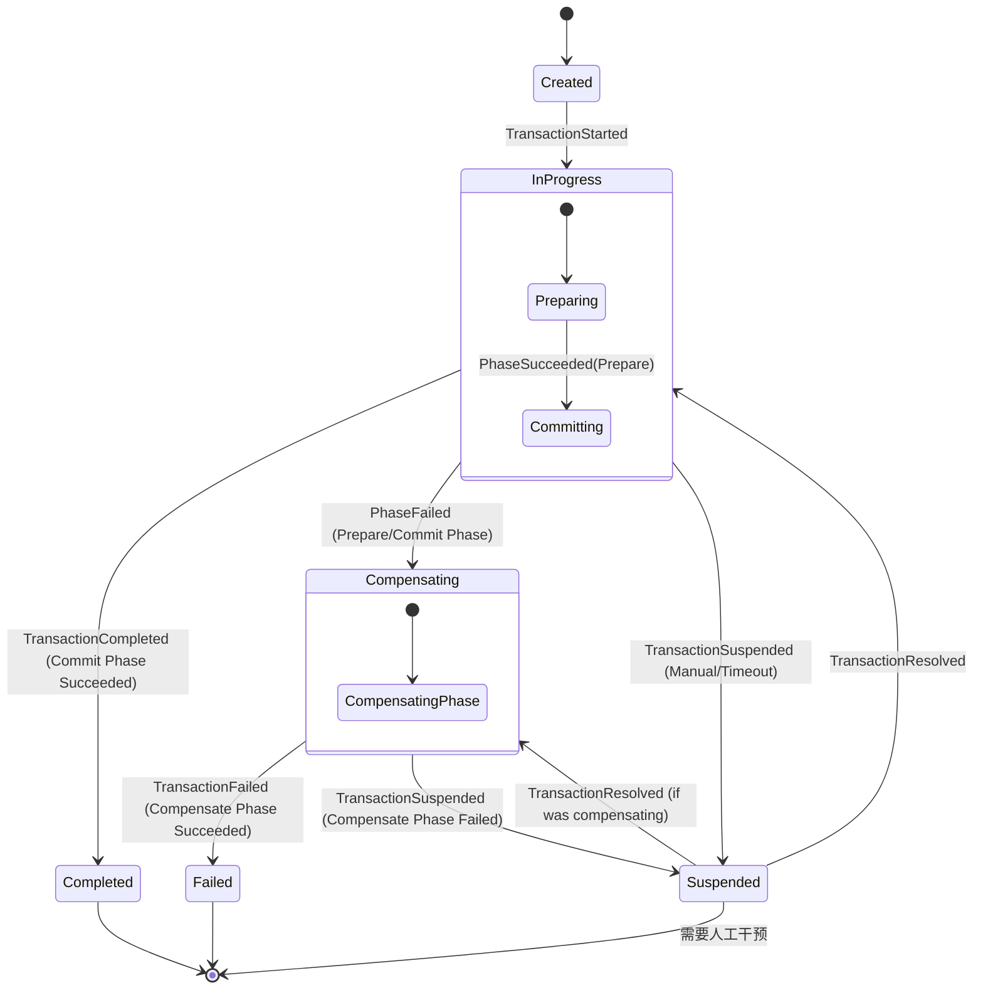

# Saga 框架概览与设计原则

## 简介

在微服务架构或基于隔离聚合的分布式系统（如我们的 Akka CQRS 设置）中，跨多个服务维持一致性是一个挑战。传统的两阶段提交 (2PC) 通常过于沉重，且在分布式高可用环境中扩展性较差。

我们的 **Saga 框架** 提供了一个强大的解决方案，使用 **Saga 模式**（具体通过 **TCC (Try-Confirm-Cancel)** 模型实现）来管理 **分布式事务**。

## 设计目标 (ACID 取舍)

Saga 框架旨在通过在传统的 ACID 模型中进行特定取舍，来管理长周期的业务流程：

- **原子性 (Atomicity)**：由框架保证。事务要么完成所有阶段（准备 -> 提交），要么通过**补偿**阶段撤销更改。
- **一致性 (Consistency)**：系统从一个一致状态转移到另一个一致状态，但遵循的是**最终一致性 (Eventual Consistency)**。在执行期间，系统可能处于临时的中间状态。
- **隔离性 (Isolation)**：为了性能和可用性而**被牺牲**。与 2PC 不同，Saga 的中间结果在整个 Saga 完成之前对其他事务是可见的。这是 Saga 模式的核心特征。
- **持久性 (Durability)**：通过**事件溯源 (Event Sourcing)** 得到保证。通过持久化 `SagaTransactionCoordinator` 的每一次状态转换，我们确保事务进度在系统崩溃后依然存在，并能可靠地恢复。

## 核心概念：TCC 模式

框架将 TCC 模式映射到三个不同的阶段：

1.  **准备 (Prepare/Try)**：预留资源或进行初步检查。参与者应确保如果 Prepare 成功，随后的 Commit 能够保证（或极大概率）成功。
2.  **提交 (Commit/Confirm)**：完成操作。只有在所有参与者的 Prepare 阶段都成功时，才会触发此阶段。
3.  **补偿 (Compensate/Cancel)**：撤销在 Prepare 阶段执行的操作。如果 Prepare 或 Commit 阶段中的任何步骤失败，则触发此阶段。

> **重要提示**：所有参与者操作（Prepare、Commit、Compensate）**必须是幂等的**。在发生瞬时故障或超时时，框架可能会多次重试这些操作。

## Saga 生命周期

以下状态图展示了由 `SagaTransactionCoordinator` 管理的 Saga 事务的高级状态转换：

## 为什么选择事件溯源？

通过为 `SagaTransactionCoordinator` 使用事件溯源，我们获得了：
1.  **容错性**：如果协调器 Actor 崩溃，它通过重播其事件日志来恢复状态，并从中断的确切位置恢复事务。
2.  **可审计性**：持久化了每一次状态转换和步骤结果的完整历史，为复杂的分布式工作流提供了清晰的审计追踪。
3.  **可观测性**：我们可以轻松追踪故障的影响范围，并准确查看哪些参与者受到了影响。
